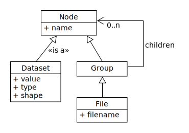
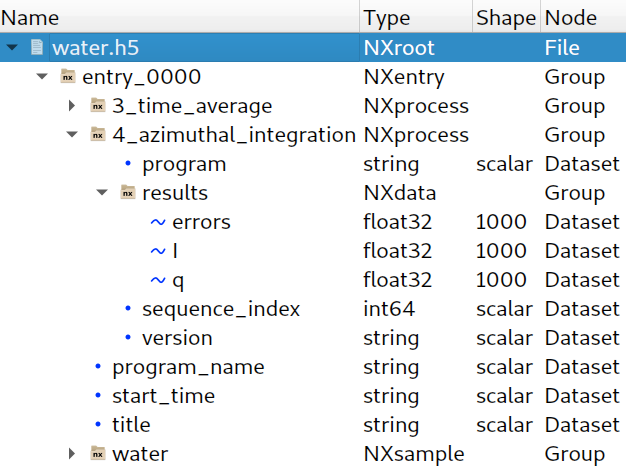
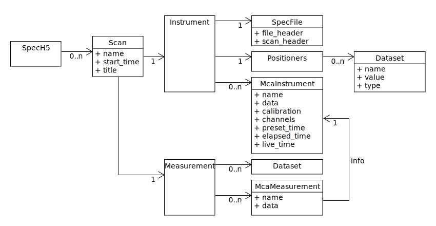
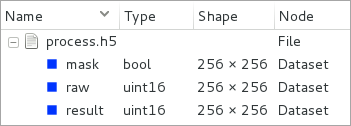

************
Input/output
************

----

Accessing ESRF data
===================

ESRF data come in (too many) different formats:

- Specfile
- EDF
- HDF5

and specific detector formats:

- MarCCD
- Pilatus CBF
- Dectris Eiger
- …

HDF5 is expected to become the standard ESRF data format.
Some beamlines have already switched.

----

Getting ready to access ESRF data
=================================

Python modules for data access developed by the DAU.

- ``silx``

  - Started in 2015
  - Will provides input/output for PyMCA
  - Also provides fitting, image processing, plotting, a set of widgets…
  - Managed by the DAU

- ``FabIO``

  - Provides access to several image data formats
  - Developed as part of the Fable project, initially an ID11 development.
  - Now managed by the DAU

Silx projet: http://www.silx.org/

----

Getting ready to access ESRF data
=================================

Already available for most ESRF computers

   >>> apt-get install python-silx python-fabio

Available for Windows, Linux, Mac OS X

   >>> pip install silx fabio

Also available from source code (under MIT license)

- GitHub: https://github.com/silx-kit

----

HDF5 introduction
=================

HDF5 (for Hierarchical Data Format) is a file format to structure and store
data for high volume and complex data

- Hierarchical collection of data (directory and file, UNIX-like path)
- High-performance (binary)
- Standard exchange format for heterogeneous data
- Self-describing extensible types, rich metadata
- Support data compression

Data can be mostly anything: image, table, graphs, documents

----

HDF5 description
================

The container is mostly structured with:

- **File**: the root of the container
- **Group**: a grouping structure containing groups or datasets
- **Dataset**: a multidimensional array of data elements
- And other features (links, attributes, datatypes)

----

HDF5 example
============

Here is an example of file generated by ``pyFAI``.

----

HDF5 using silx
===============

``Silx`` provides a unique read API for HDF5 files, and other format like
specfiles.

Read example
------------

   .. code-block:: python

      import silx.io.utils

      h5file = silx.io.utils.load('data/test.h5')

      # print available names at the first level
      print(h5file['/'].keys())

      # reaching a dataset from a sub group
      dataset = h5file['/diff_map_0000/data/map']

      # using size and types to not read the full stored data
      print(dataset.shape, dataset.size, dataset.dtype)

      # datasets mimics numpy-array
      # read and apply the operation
      a = 2 * dataset[0, 5]
      # copy the data and store it as a numpy-array
      b = dataset[...]

----

HDF5 using h5py
===============

``Silx`` does not yet provide write API.

Write example
-------------

   .. code-block:: python

      import numpy
      import h5py

      data = numpy.arange(10000.0)
      data.shape = 100, 100

      # write
      h5file = h5py.File('my_first_one.h5', access='w')

      # write data into a dataset from the root
      h5file['/data1'] = data

      # write data into a dataset from group1
      h5file['/group1/data2'] = data

      h5file.close()

----

HDF5 tools
==========

- ``h5ls``, ``h5dump``, ``hdfview``
- ``h5py``
- ``silx``
- ``PyMCA``
- The HDF group provides a web page with more tools
  https://support.hdfgroup.org/HDF5/doc/RM/Tools.html

----

Specfile using silx
===================

``Silx`` provides access to spec files using an HDF5-like mapping. It is a
subset of the HDF5 model.

HDF5-like mapping
-----------------

----

Specfile using silx
===================

File
----

- ``oleg.dat``

  - ``94.1``
  - ``95.1``
  - ``96.1``
  - ...

----

Specfile using silx
===================

Scan record
-----------

- ``oleg.dat/94.1``

  - ``start_time = "2011-02-10T22:43:43"``
  - ``title = "..."``
  - ``instrument``

    - ``positioners``

      - ``PhiD = "..."``
      - ``TRT = "..."``
      - ...

  - ``measurement``

    - ``ACEdet = "..."``
    - ``Detector = "..."``
    - ...

----

Specfile using silx
===================

MCAs
----

- ``oleg.dat/94.1``

  - ``instrument``

    - ``mca_0``

      - ``data = ...``
      - ``calibration = ...``
      - ``channels = ...``

    - ``mca_1``
    - ...

  - ``measurement``

    - ``mca_0``

      - ``data → /94.1/instrument/mca_0/data``
      - ``info → /94.1/instrument/mca_0``

----

Specfile using silx
===================

Python example
--------------

   .. code-block:: python

      import silx.io.utils

      specdata = silx.io.utils.load('data/oleg.dat')

      # print available scans
      print(specdata['/'].keys())

      # print available measurements from the scan 94.1
      print(specdata['/94.1/measurement'].keys())

      # get data from measurement
      xdata = specdata['/94.1/measurement/Epoch']
      ydata = specdata['/94.1/measurement/bpmi']

For more information and examples you can read the
silx IO tutorial:
https://github.com/silx-kit/silx-training/blob/master/silx/io/io.pdf

----

EDF using FabIO
===============

- ``Silx`` **will** provide an HDF5-like mapping for raster images based
  on ``FabIO``.
- It is not yet available
- Use FabIO

Reading files
-------------

   .. code-block:: python

      import fabio

      image = fabio.open("data/medipix.edf")

      # here is the data as a numpy array
      image.data

      # here is the header as key-value dictionary
      image.header

``FabIO`` also support multi-frames (more than one image in a single file).

----

EDF using FabIO
===============

Writing files
-------------

   .. code-block:: python

      import fabio
      import numpy

      image = numpy.random.rand(10, 10)
      metadata = {'pixel_size': '0.2'}

      image = fabio.edfimage.edfimage(data=image, header=metadata)
      image.write('new.edf')

----

Other formats using FabIO
=========================

Reading other formats
---------------------

In addition to ESRF formats, ``FabIO`` supports image format from most
manufacturers: Mar, Rayonix, Bruker, Dectris, ADSC, Rigaku, Oxford,
General Electric…

   .. code-block:: python

      import fabio

      pilatus_image    = fabio.open('filename.cbf')
      marccd_image     = fabio.open('filename.mccd')
      # ...

      tiff_image       = fabio.open('filename.tif')
      fit2d_mask_image = fabio.open('filename.msk')
      jpeg_image       = fabio.open('filename.jpg')

----

Using PyMCA
===========

- PyMCA as Python library was previously often used
- Now prefer using ``silx`` or ``FabIO``

   .. code-block:: python

      # instead of:
      from PyMca5.PyMca import specfilewrapper
      # prefer using:
      from silx.io import specfilewrapper

   .. code-block:: python

      # instead of:
      from PyMca5.PyMca import EdfFile
      # prefer using fabio

----

File conversion
===============

- With FabIO (or the command-line ``fabio-convert``)

   .. code-block:: python

      import fabio

      image = fabio.open('data/medipix.edf')
      image = image.convert('tif')
      image.save('filename.tif')

- ``Silx`` provides helper to convert specfile to HDF5.

   .. code-block:: python

      from silx.io.spectoh5 import write_spec_to_h5

      write_spec_to_h5('data/oleg.dat', 'oleg.h5', mode='w')

There is advanced spec conversionin the silx IO tutorial:
https://github.com/silx-kit/silx-training/blob/master/silx/io/io.pdf

----

Overview
========

Preconized library according to the use case and the file format.

.. raw:: html

   <html>
   <head>
   
   </head>
   <body>
      <table class="default-table">
      <tr>
         <th>Formats</th>
         <th>Read</th>
         <th>Write</th>
      </tr>
      <tr>
         <td>HDF5</td>
         <td>silx/h5py</td>
         <td>h5py</td>
      </tr>
      <tr>
         <td>Specfile</td>
         <td>silx</td>
         <td>not a good idea</td>
      </tr>
      <tr>
         <td>EDF</td>
         <td>fabio</td>
         <td>fabio</td>
      </tr>
      <tr>
         <td>TIFF</td>
         <td>fabio</td>
         <td>fabio</td>
      </tr>
      <tr>
         <td>Other images</td>
         <td>fabio</td>
         <td>fabio</td>
      </tr>
      </table>
   </body>
   </html>

----

Exercise
========

1. Read the EDF file ``medipix.edf``.
2. Process the data

   - Create a mask for all the values below 10%.
   - With the above mask, set the affected pixels to 10%.
   - Optionally do the same for values above 90%.
   - This clamp values between 10% and 90%

3. Store the source, the mask of changed pixels and the result inside ``process.h5``, as below.

4. Load ``process.h5`` and list the root content
