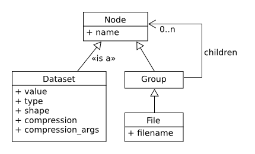
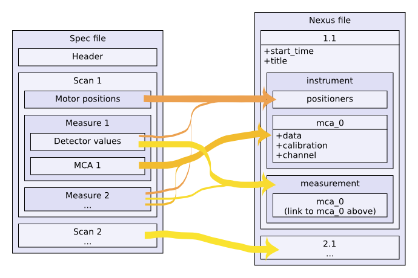

.. raw:: html

   <!-- Patch landslide slides background color --!>
   

************
Input/output
************

----

Accessing ESRF data
===================

ESRF data come in (too many) different formats:

- Spec files
- EDF
- HDF5

and specific detector formats:

- MarCCD
- Pilatus CBF
- Dectris Eiger
- …

HDF5 is expected to become the standard ESRF data format.
Some beamlines have already switched.

----

Libraries
=========

Python modules for data access

- ``FabIO``

  - Provides access to several image data formats
  - Developed as part of the Fable project, initially an ID11 development.
  - Managed by the DAU

- ``h5py``

  - Access to HDF5 files

- ``silx``

  - Started in 2015
  - Will provide input/output for PyMCA
  - Also provides fitting, image processing, plotting, a set of widgets…
  - Managed by the DAU

----

Libraries
=========

Already available for most ESRF computers

   >>> apt-get install python3-silx python3-fabio

Available for Windows, Linux, Mac OS X

   >>> pip install silx fabio

Also available from source code (under MIT license)

- https://github.com/silx-kit/silx
- https://github.com/silx-kit/fabio
- https://github.com/h5py/h5py

----

Spec files
==========

- Text format from Spec
- It contains
   - Evolution of measurments and instruments
   - During a scan
- Library
   - We do not recommand to use this format anymore
   - ``silx`` provides a HDF5-like read access to Spec files.

----

Spec compatibility
==================

- ``PyMCA`` as Python library was previously often used
- Now prefer using ``silx``

   .. code-block:: python

      # instead of
      from PyMca5.PyMca import specfilewrapper

      # prefer using
      from silx.io import specfilewrapper

----

EDF files
=========

- ESRF data format
- It contains
   - 1D/2D/3D array of float/integer
   - Header containing various informations
   - Multi-frames (more than one image in a single file)
   - Often used as file series
- Library
   - Use `FabIO`
   - ``silx`` provides a HDF5-like read access to Spec files.

----

EDF using FabIO
===============

Reading files
-------------

   .. code-block:: python

      import fabio

      image = fabio.open("data/medipix.edf")

      # here is the data as a numpy array
      image.data

      # here is the header as key-value dictionary
      image.header

----

EDF using FabIO
===============

Writing files
-------------

   .. code-block:: python

      import fabio
      import numpy

      image = numpy.random.rand(10, 10)
      metadata = {'pixel_size': '0.2'}

      image = fabio.edfimage.edfimage(data=image, header=metadata)
      image.write('new.edf')

----

Other formats using FabIO
=========================

Reading other formats
---------------------

``FabIO`` also supports image formats from most
manufacturers: Mar, Rayonix, Bruker, Dectris, ADSC, Rigaku, Oxford,
General Electric…

   .. code-block:: python

      import fabio

      pilatus_image    = fabio.open('filename.cbf')
      marccd_image     = fabio.open('filename.mccd')

      tiff_image       = fabio.open('filename.tif')
      fit2d_mask_image = fabio.open('filename.msk')
      jpeg_image       = fabio.open('filename.jpg')

----

Other formats using FabIO
=========================

File conversion
---------------

- With ``FabIO`` (or the command-line ``fabio-convert``)

   .. code-block:: python

      import fabio
      image = fabio.open('data/medipix.edf')
      image = image.convert('tif')
      image.save('filename.tif')

----

HDF5 files
==========

HDF5 (for Hierarchical Data Format) is a file format to structure and store
data for high volume and complex data

- Hierarchical collection of data (directory and file, UNIX-like path)
- High-performance (binary)
- Standard exchange format for heterogeneous data
- Self-describing extensible types, rich metadata
- Support data compression

Data can be mostly anything: image, table, graphs, documents

----

HDF5 description
================

The container is mostly structured with:

- **File**: the root of the container
- **Group**: a grouping structure containing groups or datasets
- **Dataset**: a multidimensional array of data elements
- And other features (links, attributes, datatypes)

----

HDF5 example
============

Here is an example of file generated by ``pyFAI``.

.. image:: images/hdf5_example.png

----

HDF5 using h5py
===============

``h5py`` provides an API to read and write files

Read example
------------

   .. code-block:: python

      import h5py

      h5file = h5py.File('data/test.h5', mode='r')

      # print available children at the first level
      print(list(h5file['/'].keys()))

      # reaching a dataset from a sub group
      dataset = h5file['/diff_map_0000/data/map']

      # using size and types to not read the full stored data
      print(dataset.shape, dataset.size, dataset.dtype)

      # datasets mimics numpy-array
      # read and apply the operation
      a = 2 * dataset[0, 5]
      # copy the data and store it as a numpy-array
      b = dataset[...]

----

HDF5 using h5py
===============

Write example
-------------

   .. code-block:: python

      import numpy
      import h5py

      data = numpy.arange(10000.0)
      data.shape = 100, 100

      # write
      h5file = h5py.File('my_first_one.h5', mode='w')

      # write data into a dataset from the root
      h5file['/data1'] = data

      # write data into a dataset from group1
      h5file['/group1/data2'] = data

      h5file.close()

----

HDF5 tools
==========

- ``h5ls``, ``h5dump``, ``hdfview``
- ``h5py``
- ``silx``
- ``silx view``
- The HDF group provides a web page with more tools
  https://support.hdfgroup.org/HDF5/doc/RM/Tools.html

----

Silx input/output
=================

- Try to simplify the transition to HDF5
   - Provide a h5py-like API on top of format used at ESRF
   - Single way to access to Spec/EDF/HDF5 files
   - Based on NeXus specifications
     http://www.nexusformat.org/
- Read-only

----

Spec files using silx
=====================

HDF5-like mapping
-----------------

----

Spec files using silx
=====================

Example
-------

   .. code-block:: python

      import silx.io
      data = silx.io.open('data/oleg.dat')

      # print available scans
      print(data['/'].keys())

      # print available measurements from the scan 94.1
      print(data['/94.1/measurement'].keys())

      # get data from measurement
      xdata = data['/94.1/measurement/Epoch']
      ydata = data['/94.1/measurement/bpmi']

For more information and examples you can read the
silx IO tutorial:
https://github.com/silx-kit/silx-training/blob/master/silx/io/io.pdf

----

EDF files using silx
====================

HDF5-like mapping
-----------------

.. image:: images/fabioh5_arrows.png

----

EDF files using silx
====================

Example
-------

   .. code-block:: python

      import silx.io
      data = silx.io.open('data/ID16B_diatomee.edf')

      # Access to the frames
      frames = data['/scan_0/instrument/detector_0/data']
      len(frames)  # number of frames
      frames[0]    # first frame

      # Access to motors, monitor, timestanp
      srot = data['scan_0/instrument/positioners/srot'][...]
      mon = data['scan_0/measurement/mon'][...]
      timestamp = data[
          'scan_0/instrument/detector_0/others/time_of_day'][...]

----

Overview
========

Preconized library according to the use case and the file format.

.. raw:: html

   <html>
   <head>
   
   </head>
   <body>
      <table class="default-table">
      <tr>
         <th>Formats</th>
         <th>Read</th>
         <th>Write</th>
      </tr>
      <tr>
         <td>HDF5</td>
         <td>silx/h5py</td>
         <td>h5py</td>
      </tr>
      <tr>
         <td>Specfile</td>
         <td>silx</td>
         <td></td>
      </tr>
      <tr>
         <td>EDF multiframe</td>
         <td>silx/fabio</td>
         <td>fabio</td>
      </tr>
      <tr>
         <td>EDF</td>
         <td>fabio</td>
         <td>fabio</td>
      </tr>
      <tr>
         <td>Other raster formats</td>
         <td>fabio</td>
         <td>fabio</td>
      </tr>
      </table>
   </body>
   </html>

----

Exercise
========

1. Read the EDF file ``medipix.edf``.
2. Process the data

   - Create a mask for all the values below 10%.
   - With the above mask, set the affected pixels to 10%.
   - Optionally do the same for values above 90%.
   - This clamp values between 10% and 90%

3. Store the source, the mask of changed pixels and the result inside ``process.h5``, as below.

.. image:: images/exercise-result.png

4. Load ``process.h5`` and list the root content
