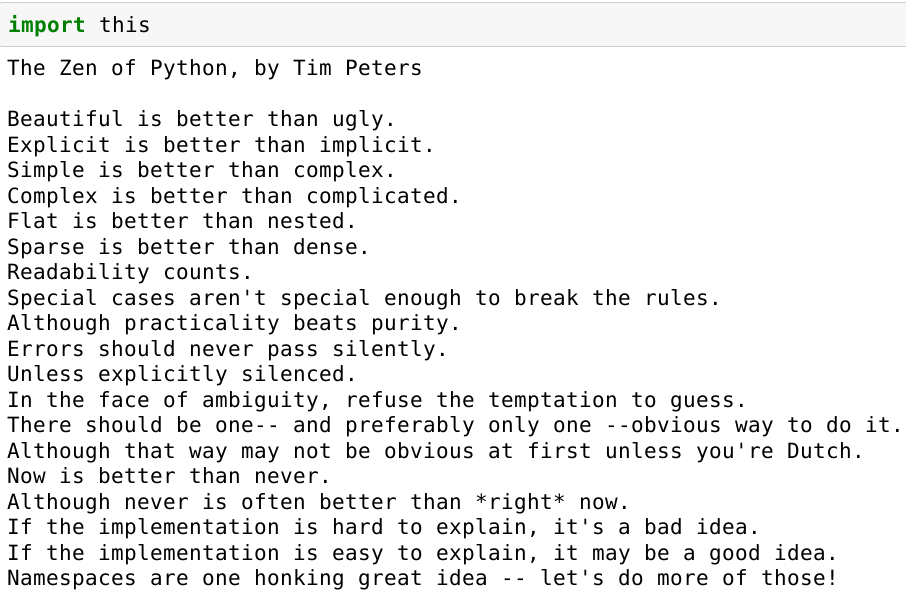

Extra informations
==================

----

Editors and IDE
---------------

----

Python interpreter's advanced options
^^^^^^^^^^^^^^^^^^^^^^^^^^^^^^^^^^^^^

Some useful option for the C-Python interpreter:

- \-d to switch to debug mode
- \-i enter  interactive  mode  after executing  the command (can be suefull for debugging)
- \-v verbose mode (tells when modules are imported)
- \-u to enforce stdout/stderr unbuffered (when multi-threaded)

under linux :

    .. code-block:: bash

        python -v myscript.py

more details and command at :
    - https://docs.python.org/3/tutorial/interpreter.html
    - https://docs.python.org/3/using/cmdline.html#using-on-general

----

ipython (1)
^^^^^^^^^^^

Interactive Python interpreter, the ancestor of Jupyter

Pylab mode for ipython
""""""""""""""""""""""

- Integrated profiling tool: %timeit myfunction()

- Pylab extenstion: '$ ipython --pylab' or '%pylab' directly in a ipython console
    - Auto import many modules:
        - numpy as np
        - from pylab import *
    - Sets a default GUI mainloop()  (Tk, Gtk or Qt)
        - Can also be initialized without pylab in an ipython console “%gui qt”
    - Provides direct access to plot and imshow:
        - plot([sin(x/100.) for x in range(2000)])
        - imshow(np.arange(10000).reshape((100,100)))

----

ipython (2)
^^^^^^^^^^^

Alternative consoles
""""""""""""""""""""

- jupyter notebook

    .. code-block:: bash

        $ jupyter-notebook

- qtconsole

    .. code-block:: bash

        $ ipython qtconsole

----

Integrated Development Environment
^^^^^^^^^^^^^^^^^^^^^^^^^^^^^^^^^^

- Python centric editors:
    - IDLE: Python/TK GUI oftently provided by default with python
    - Spyder Python/Qt designed to have a Matlab look & feel
        - Available under WinPython

- General editors
    - vim, Emacs, nedit, ... have color highlighting for Python
    - PyDev module of Eclipse
    - PyCharm
    - sublime-text

----

Zen of python
-------------

