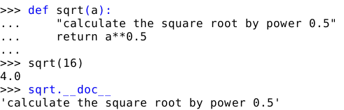

Functions
=========

----

How to create a function?
-------------------------

Definition in the source code
^^^^^^^^^^^^^^^^^^^^^^^^^^^^^

use the 'def' statement to define a new function

    .. code-block:: python

        def myadd(myparam1, myparam2):
            print('my first parameter is %s' % myparam1)
            print('my second parameter is %s' % myparam2)
            return myparam1 + myparam2

Documentation of the function
^^^^^^^^^^^^^^^^^^^^^^^^^^^^^

One should use a *doc-string*, i.e. a string defining what the function does as
first statement of the function:

----

Hands on
--------

Write a function that takes a, b and c as imput and return the list of solutions for:
    :math:`{a.x^2}+b.x+c=0`

----

Solution
--------

Definition of the function :

    .. code-block:: python

        def sqrt(x):
            return x**(0.5)

        def polynom(a, b, c):
            delta = b*b - 4.0*a*c
            solutions=[]
            if delta > 0 :
                solutions.append((-b - sqrt(delta)) / (2.0*a))
                solutions.append((-b + sqrt(delta)) / (2.0*a))
            elif delta == 0 :
                solutions.append(b/(2.0*a))
            return solutions

Call of the function :

    .. code-block:: python

        polynom(1, 2, -3)

----

function parameter (1)
----------------------

- optional parameters

    .. code-block:: python

        def myfunction(myparam=5):
            print('my parameter is %s' % myparam)

    - ``myfunction()`` prints "my parameter is 5"
    - ``myfunction('toto')`` prints "my parameter is toto"

- any parameters

    - The parameter preceded by a star is a list containing all un-named arguments
        - ``myfunction(*unamedargs)``
    - The parameter preceded by two stars is a dictionary  containing all named arguments
        - ``myfunction(**namedargs)``

----

function parameter (2)
----------------------

    Example of a function with 'any parameters'

    .. code-block:: python

        def myfunction(r, n=12, *arglist, **argdict):
            print('r param = %s' %r)
            print('n param = %s' %n)
            if len(arglist) > 0:
                print('got %s unnamed argument ' %len(arglist))
                for arg in arglist :
                    print('- %s' % arg)
            if len(argdict) > 0:
                print('got %s named argument ' %len(argdict))
                for key in argdict :
                    print('- name = %s , value = %s ' % (key, argdict[key]))

    .. image:: img/function_anyparameteroutput.png
        :width: 600px
        :height: 200px

----

function parameter (2)
----------------------

.. warning:: Never use mutable object as default parameter !!!

    If the parameter is a mutable, its default value should generally be None (immutable)

    .. code-block:: python

	    >>> def bad_append(default_list=[]):
            ...    """Append 1 to provided list and return it.
            ...    If no list is given as parameter, use empty list."""
	    ...    default_list.append(1)
	    ...    return default_list
	    ... 
	    >>> print(bad_append())
	    >>> print(bad_append())
	    >>> print(bad_append())
	    [1]
	    [1, 1]
	    [1, 1, 1]

	    >>> def good_append(default_list=None):
	    ...    if default_list is None:
	    ...         return [1]
	    ...     default_list.append(1)
	    ...     return default_list
	    ...

----

lambda function
---------------

You can defined anonymous functions :

.. code-block:: python

    pow2=lambda x: x*x
    ...
    plot(range(100), list(map(lambda x: numpy.log10(x), range(100)) ))

**Nota:** We don't expect you to use lambda, but this is just to explain why you can get the following error:

.. code-block:: python

    >>> lambda = 1.3e-10
    File "<stdin>", line 1
         lambda = 1.3e-10
               ^
    SyntaxError: invalid syntax

Indeed *lambda* is a **reserved keyword**
