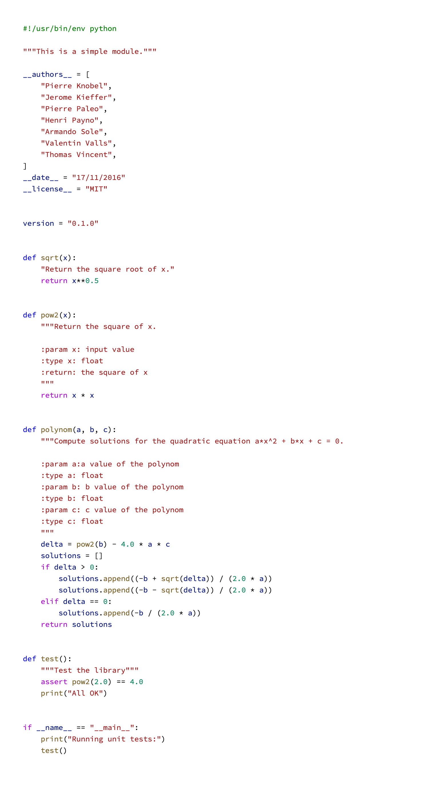

Modules
=======

----

Create modules with your functions
----------------------------------

A good practice is to start each new python file with the following line to specify the file encoding : 

    .. code-block:: python

        # coding: utf-8

----

Example of a module
^^^^^^^^^^^^^^^^^^^

----

import
------

There is many ways to import modules / from module

    .. code-block:: python

        import mymodule
        mymodule.pow2(3)

        import mymodule as module
        module.pow2(4)

        from mymodule import pow2
        pow2(5)

        # ! import all from a module can be dangerous because
        # it will pollutes the local name-space
        from mymodule import *
        pow2(6)
        

You can also access to the attributes of the module

    .. code-block:: python

        import mymodule
        mymodule.__authors__
        mymodule.__doc__

----

Exercise - write a module 
-------------------------

0. create a new file exercise.py, set file encoding and documentation

1. add a function into this file like polynom(a, b, c) defined previously (+ a test)

2. execute this file as a script:
    - using:

    .. code-block:: python

        if __name__ == '__main__':
            # operations to be executed

    - execute python exercise.py

3. load this module from a python console (jupyter-notebook, ipython console ... ) and import your module. 
4. execute the function from the console and run the test.

----

Standard modules
----------------

"Batteries included philosophy"

- Modules sys, os, shutil, glob, copy
- Modules string, re, collections
- Modules math, random, decimal
- Module time, datetime
- Internet access with email, urllib2, smtplib
- Multi-core programming with multiprocessing, threading, thread
- Handle compressed archives with gzip, bz2, zlib, zipfile, tarfile
- Execute another program with subprocess, shlex
- Quality control with unittest and doctest
- Performance control with timeit, profile and cProfile
- Logging capabilities: logging

----

Non standard modules
--------------------

- General purpose mathematics libraries:
    - NumPy
    - SciPy
- Input/Output libraries to handle data acquired at ESRF
    - EdfFile/SpecFile
    - FabIO
    - H5py
- Visualization libraries (curves, images, ...)
    - Matplotlib
    - Silx
- Image handling library:
    - Python Imaging Library (PIL → Pillow)

They will be introduced this afternoon.

----

Documentation generator
^^^^^^^^^^^^^^^^^^^^^^^

.. note:: 
    
    ':param', ':type',  etc can be used for
    formatting documentation using automatic documentation generators like : 
    

- Sphinx ( http://www.sphinx-doc.org/en/1.4.8/ )
- Epydoc ( https://pypi.python.org/pypi/epydoc/ )
- Doxygen ( http://www.stack.nl/~dimitri/doxygen/)

