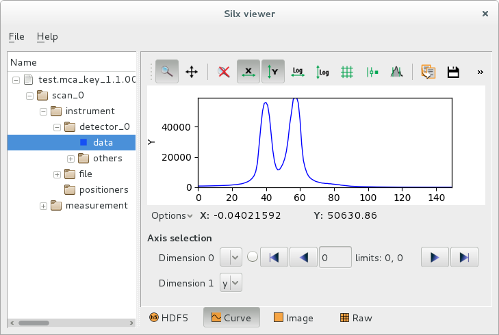

.. raw:: html

   <!-- Patch landslide slides background color --!>
   

Applications
************

----

Introduction to data formats
============================

- HDF5 is going to be a major data format at the ESRF, and will likely
  replace many existing formats.

- The NeXus format adds a layer of standards to write data as HDF5
  (or any other hierarchical format) for neutron, x-ray, and muon science.

- *silx* applications interpret all supported data formats
  (EDF, SPEC...) as if they were NeXus + HDF5 data.

More on this subject later, in the IO section of the training.  
 
----

silx view
=========

- Visualisation of data formats used at the ESRF

  - Support HDF5 files, Spec files, EDF files (plus all formats supported by `FabIO`)
  - All formats displayed in a HDF5-like structure with NeXus
  - HDF5 tree widget for selecting data items
  - DataViewer widget for visualising datasets as curves, or images, 
    or stack of images, or raw values in a table

.. code-block:: bash

    silx view somefile.edf

----

----

silx convert: Use cases
=======================

- Conversion of all supported data formats to HDF5 + NeXus.

  - The output file has exactly the same structure as displayed 
    by the *silx view* application.

- Merging stack of single image files into a 3D cube

----

silx convert: examples
======================

Converting a single file:

.. code-block:: bash

    silx convert somefile.edf -o output_file.h5

Merging a series of EDF image files into a 3D stack:
    
.. code-block:: bash

    silx convert --file-pattern ch09__mca_0005_0000_%d.edf -o ch09__mca_0005_0000_multiframe.h5

Converting a SPEC file and appending a stack of EDF images into a specific scan:
    
.. code-block:: bash

    silx convert spec_file.dat -o output_file.h5
    silx convert --file-pattern scan27_%d.edf -o output_file.h5::/27.1/instrument --mode a
    

----

Exercises
=========

#. Display the help for both *silx view* and *silx convert* commands, an a shell terminal. (option *-h*)

#. Display the data from detector *If4* in the scan *26.1* in file *31oct98.dat*, as a curve.

   #. Find how to change the curve style to show the data points without the lines connecting them.
   #. Try to fit the curve with 2 or 3 gaussian peaks.

#. Merge a series of single frame EDF files into a 3D stack. EDF files are in the *ch09* folder.

   #. Display the result as a stack of images, with dimension 0 as Y and dimension 1 as X.
   #. Display frame number 886, modify the colormap to use a logarithmic scale
   #. Do a horizontal profile in the middle, switch to "1D profile on visible image" mode.
