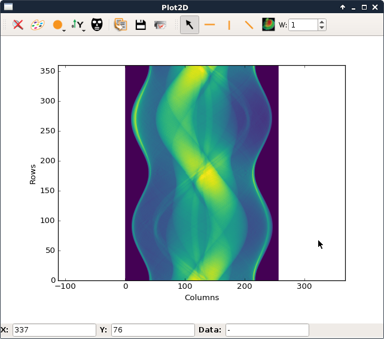
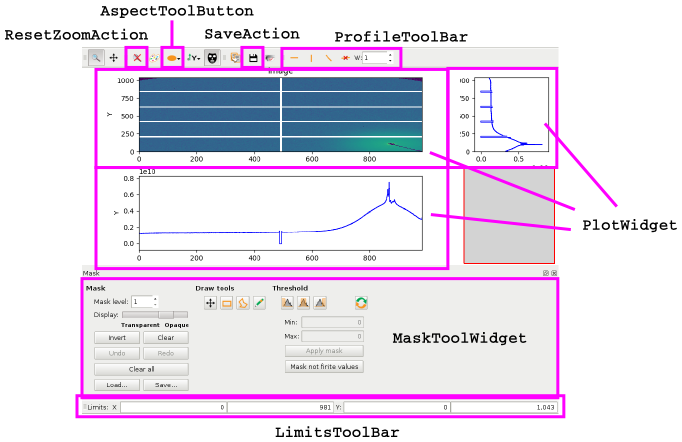

silx.gui.plot
-------------

Set of widgets to visualise 1D and 2D data:

- curves, histogram
- images: data, RGB(A), image stack, complex image
- scatter

Initially an heritage from PyMca.

.. list-table::

   * - .. image:: img/plot/Plot1D.png
          :height: 250px
          :align: center
     - .. image:: img/plot/plot2D_sino.png
          :height: 250px
          :align: center

----

silx.gui.plot
-------------

With associated tools:

- Region of interest
- Mask
- Profile
- ...

.. list-table::

   * - .. image:: img/plot/roiwidget.png
          :height: 250px
          :align: center
     - .. image:: img/plot/mask.png
          :height: 250px
          :align: center

----

silx.gui.plot main widgets
--------------------------

0. Plot1D
#. Plot2D
#. PlotWindow
#. ImageView
#. ComplexImageView
#. StackView

----

Plot1D
------

Plot curves and histograms, control axes scale,...

.. code-block:: python

   from silx.gui.plot import Plot1D
   widget = Plot1D()
   widget.show()
   widget.addCurve(x, y, legend='my curve')

.. image:: img/plot/Plot1D.png
   :height: 300px
   :align: center

Hands-on: http://www.silx.org/doc/silx/latest/modules/gui/plot/getting_started.html#plot-curves-in-a-widget

----

Plot2D
------

Plot images, control aspect ratio, colormap,...

.. code-block:: python

   from silx.gui.plot import Plot2D
   widget = Plot2D()
   widget.show()
   widget.addImage(image, legend='my image')

Hands-on: http://www.silx.org/doc/silx/latest/modules/gui/plot/getting_started.html#plot-images-in-a-widget

----

PlotWindow
----------

A plotting widget with a *generic* toolbar.

.. code-block:: python

   from silx.gui.plot import PlotWindow
   window = PlotWindow()
   window.show()

.. image:: img/plot/PlotWindow.png
   :height: 300px
   :align: center

----

ImageView
---------

Plot an image with side histograms

.. code-block:: python

   from silx.gui.plot.ImageView import ImageView
   widget = ImageView()
   widget.show()
   widget.setImage(image)

.. image:: img/plot/ImageView.png
   :height: 300px
   :align: center

Doc: http://www.silx.org/doc/silx/latest/modules/gui/plot/imageview.html

----

ComplexImageView
----------------

Plot an image of complex, control visualisation,...

.. code-block:: python

   from silx.gui.plot.ComplexImageView import ComplexImageView
   widget = ComplexImageView()
   widget.show()
   widget.setData(image)
   widget.resetZoom()

.. image:: img/plot/ComplexImageView.png
   :height: 300px
   :align: center

Doc: http://www.silx.org/doc/silx/latest/modules/gui/plot/compleximageview.html

----

StackView
---------

Display 3D volume as a stack of 2D images

.. code-block:: python

   from silx.gui.plot.StackView import StackView
   widget = StackView()
   widget.show()
   widget.setStack(stack)
   widget.resetZoom()

.. image:: img/plot/StackView.png
   :height: 300px
   :align: center

Doc: http://www.silx.org/doc/silx/latest/modules/gui/plot/stackview.html

----

PlotWidget
----------

Previous widgets share a common basis: ``silx.gui.plot.PlotWidget``

It provides methods to:

- control plot content: ``addCurve``, ``addImage``, ..., ``getCurve``, ..., ``remove``, ``clear``
- control axes: ``resetZoom``, ``setKeepDataAspectRatio``, ``getXAxis``, ``getYAxis``,...
- react on plot changes through Qt signals
- ...

Doc: http://www.silx.org/doc/silx/latest/modules/gui/plot/plotwidget.html

----

PlotWidget backends
-------------------

``PlotWidget`` can use two backends for rendering:

- **matplotlib** (the default):

  .. code-block:: python

    from silx.gui.plot import PlotWidget
    w = PlotWidget(backend='matplotlib')
    w.show()
  
- **OpenGL** (requires PyOpenGL and OpenGL2.1):

  .. code-block:: python

    from silx.gui.plot import PlotWidget
    w = PlotWidget(backend='gl')
    w.show()
 

----

PlotWidget content
------------------

- **silx.gui.plot.items** provides objects describing visualised data.

  .. code-block:: python

     curve = myPlotWidget.getCurve(legend='my curve')
     x = curve.getXData()
     curve.setColor('green')

  Doc: http://www.silx.org/doc/silx/latest/modules/gui/plot/items.html

- **silx.gui.plot.Colormap.Colormap** describes colormap.

  .. code-block:: python

     image = myPlotWidget.getImage(legend='my image')
     colormap = image.getColormap()
     colormap.setName('viridis')
     colormap.setVRange(0.1, 1.)

  Doc: http://www.silx.org/doc/silx/latest/modules/gui/plot/colormap.html

----

PlotWidget tools
----------------

