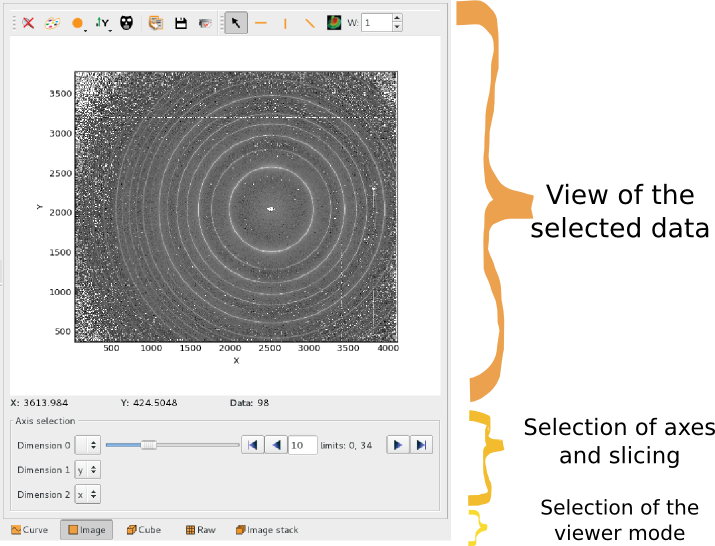

.. raw:: html

   <!-- Patch landslide slides background color --!>
   

Input/output
************

----

Silx IO
=======

- Provides function to open file data

  - Accessible as HDF5-like objects
  - In read-only
  - Support HDF5 files, Spec files, EDF files (plus format supported by `FabIO`)

- In symbiosis with our widgets

  - HDF5 tree widget
  - DataViewer

- Also contains

  - Maintained `specfilewrapper` class
  - Maintained TIFF and EdfFile reader and writer
  - Spec to HDF5 converter
  - Dictionary dump

----

HDF5 introduction
=================

HDF5 (for Hierarchical Data Format) is a file format to structure and store
data.

- Standard exchange format for heterogeneous data
- Hierarchical collection of data (directory and file, UNIX-like path)

  - **File**: the root of the container
  - **Group**: a grouping structure containing groups or datasets
  - **Dataset**: a multidimensional array of data elements
  - And other features (links, attributes, datatypes)

.. image:: img/hdf5.png

----

HDF5 example
============

Here is an example of file generated by ``pyFAI``.

.. image:: img/hdf5_example.png

----

NeXus introduction
==================

NeXus is a common data format for neutron, x-ray and muon science based on
HDF5.

Set of rules to structure a HDF5 file for interoperability of the data.

We tries to follow NeXus convention to display data or to expose data.

.. image:: img/nexus.png

----

Specfile with silx
==================

``Silx`` provides access to spec files using an HDF5-like mapping. It uses a
subset of the HDF5 model, based on NeXus.

HDF5-like mapping
-----------------

.. image:: img/spech5_arrows.png

----

EDF with silx
=============

``Silx`` provides access to EDF files (and other format supported by `FabIO`)
using an HDF5-like mapping. It is a subset of the HDF5 model, based on NeXus.

HDF5-like mapping
-----------------

.. image:: img/fabioh5_arrows.png

----

Silx IO API
===========

Based on HDF5 and `h5py` module API.

Open a file
-----------

   .. code-block:: python

      import silx.io

      # open
      obj = silx.io.open(filename)
      # do your stuff here
      obj.close()

      # or using context manager
      with silx.io.open(filename) as obj:
         # do your stuff here
         # the close is called for you at the end of the with

----

Silx IO API
===========

Based on HDF5 and `h5py` module API.

Common properties
-----------------

   .. code-block:: python

      obj.name   # the path name
      obj.parent # the direct container of the object
      obj.file   # the file container of the object

      # test object type
      if silx.io.is_file(obj):
         print("this is a root file")

         # path of the file from the file system
         obj.filename

      if silx.io.is_group(obj):
         # BTW a file is a group
         print("this is a group")

      if silx.io.is_dataset(obj):
         print("this is a dataset")

----

Silx IO API
===========

Based on HDF5 and `h5py` module API.

Node traversal
--------------

   .. code-block:: python

      if silx.io.is_group(obj):
         # it can contains child

         # number of child
         len(obj)

         # iterator on child names
         obj.keys()

         # access to a child
         child = obj["child_name"]

         # access to a child using a path
         child = obj["path/to/a/child"]

         # the path can be absolute
         child = obj["/absolute/path/to/a/child"]

----

Silx IO API
===========

The content of a dataset is a `numpy` data.

Data access
-----------

   .. code-block:: python

      if silx.io.is_dataset(obj):
         # it contains data

         # a dataset provides information to the data
         obj.shape    # multidimentional shape
         obj.size     # amount of items
         obj.dtype    # type of the array

         # copy the full data as numpy array
         data = obj[...]

         # or a part of it (using numpy selector)
         data = obj[1:2, ::3, 7]

         # special case to access to the value of a scalar
         # i.e. a single integer, a single string...
         data = obj[()]

----

Silx IO API
===========

Specfile example
----------------

   .. code-block:: python

      import silx.io

      h5like = silx.io.open('data/oleg.dat')

      # print available scans
      print(h5like['/'].keys())

      # print available measurements from the scan 94.1
      print(h5like['/94.1/measurement'].keys())

      # get data from measurement
      time = h5like['/94.1/measurement/Epoch']
      bpm = h5like['/94.1/measurement/bpmi']
      mca = h5like['/94.1/measurement/mca_0/data']

----

Silx IO API
===========

EDF example
-----------

   .. code-block:: python

      import silx.io.utils

      h5like = silx.io.open("data/medipix.edf")

      # here is the data as a cube using numpy array
      # it's a cube of images * number of frames
      data = h5like["/scan_0/instrument/detector_0/data"]
      # here is the first image
      data[0]

      # groups containing datasets of motors, counters
      # and others metadata from the EDF header
      motors   = h5like["/scan_0/instrument/positioners"]
      counters = h5like["/scan_0/instrument/measurement"]
      others   = h5like["/scan_0/instrument/detector_0/others"]

      # reach a monitor named 'mon'
      # it's a vector of values * number of frames
      monitor = counters["mon"]
      # here is the monitor value at the first frame
      monitor[0]

----

HDF5 tree
=========

Tree view which allow to browse HDF5 file content.

.. image:: img/hdf5tree_legend.png

Provides:

- Mouse click event
- Customable content menu
- Customable columns

----

HDF5 tree
=========

Example
-------

Tree view which allow to browse HDF5 file content.

   .. code-block:: python

      import silx.gui.hdf5
      tree = silx.gui.hdf5.Hdf5TreeView()
      model = tree.findHdf5TreeModel()

      # Insert a filename
      model.insertFile("data/test.h5")

      # Insert an HDF5 node
      h5 = silx.io.open("data/test.h5")
      model.insertH5pyObject(h5)

----

DataViewer
==========

----

DataViewer
==========

Example
-------

   .. code-block:: python

      import silx.gui.data.DataViewerFrame
      viewer = silx.gui.data.DataViewerFrame.DataViewerFrame()
      viewer.setVisible(True)

      # Let's display a random cube
      import numpy
      data = numpy.random.rand(100, 100, 100)
      viewer.setData(data)

      # Let's display an HDF5 dataset
      import silx.io
      h5like = silx.io.open("data/ID16B_diatomee.h5")
      dataset = h5like["/data/0299"]
      viewer.setData(dataset)

----

Exercises
=========

This exercises are based on phase contrast acquisition data.

You can find it as notebook, or as Python files.

- **Exercise 1**:
    - Browse the data file
- **Exercise 2**:
    - Compute the correction
- **Exercise 3**:
    - Create a viewer
- **Exercise 4**:
    - Custom the viewer to display corrected images
