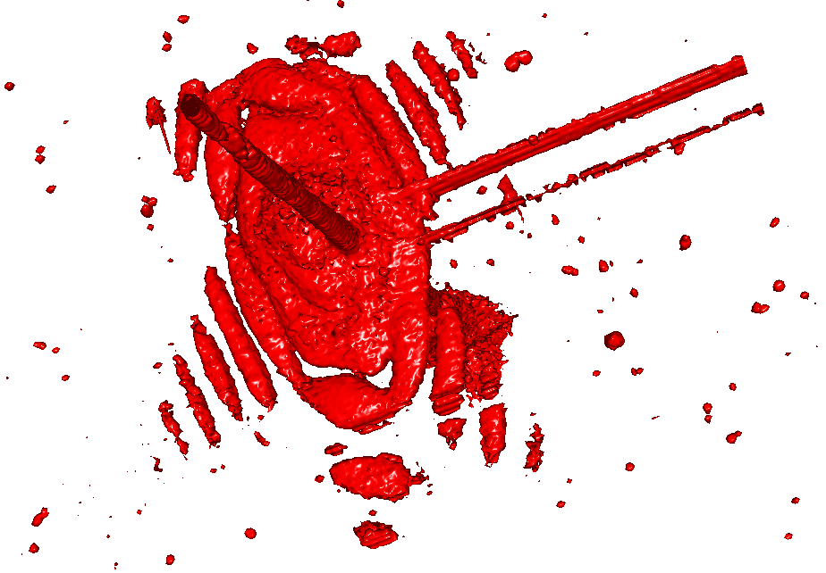

.. raw:: html

   <!-- Patch landslide slides background color --!>
   

silx.math.marchingcubes
#######################

Compute iso-surface using marching cubes algorithm.

See: http://paulbourke.net/geometry/polygonise/

::

   Lorensen, W. E. and Cline, H. E.
   Marching cubes: A high resolution 3D surface construction algorithm.
   Computer Graphics, 21, 4 (July 1987). ACM, 163-169.

----

Usage
=====

Provided a 3D numpy.array of float32 **data**:

.. code-block:: python

    from silx.math.marchingcubes import MarchingCubes

    vertices, normals, indices = MarchingCubes(data, isolevel=1.)

- ``vertices``: (Unique) 3D points of the iso-surface
- ``normals``: Normals to the surface at those points (discrete gradient of the dataset)
- ``indices``: Indices of points building up triangles of the iso-surface

Note: Output dimensions have the same order as input data.

----

Alternative
===========

Compute marching cubes **slice by slice** rather than the full dataset at once.

Provided an iterator of images **image_serie**:

.. code-block:: python

    from silx.math.marchingcubes import MarchingCubes
    import fabio

    mc = MarchingCubes(isolevel=1.) # Create object with iso-level=1
    with fabio.open('my_image_serie_file.my_format') as image_serie:
        previous_image = image_serie  # Store first image
        for image in image_serie.next():  # Loop over following images
            # Process volume 2 images by 2 images
            mc.process_slice(previous_image.data, image.data)
            previous_image = image

    vertices = mc.get_vertices() # Array of vertex positions
    normals = mc.get_normals() # Array of normals
    triangle_indices = mc.get_indices() # Array of indices of vertices

----

Parameters
==========

.. code-block:: python

    MarchingCubes(
        data=None,
        isolevel=None,
        invert_normals=True,
        sampling=(1, 1, 1))

- ``invert_normals``: Toggle normals orientation between gradient descent(default)/ascent
- ``sampling``: Sub-sampling along each dimension (depth, height, width)
