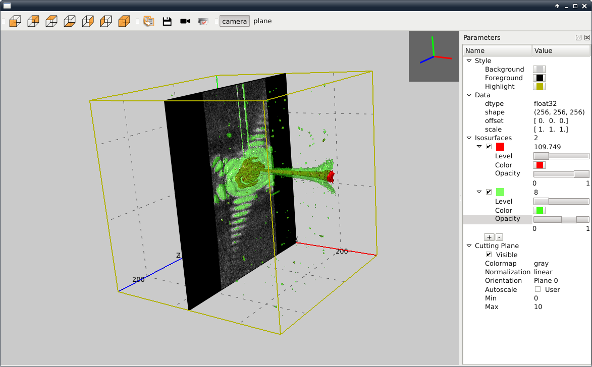

.. raw:: html

   <!-- Patch landslide slides background color --!>
   

Plot
####

----

Plot
####

- Plot widgets for 1D, 2D, 3D

- plot1D, plot2D are heritages from PyMca

.. image:: img/plot2DSinogram.png
    :width: 350px
    :height: 220px

- Many tool included 
    - ROI
    - Mask widget
    - qt console
    - profile 1D, 2D
    - ...

----

Plot
####

+ backend Plot1D-2D 
    + currently matplotlib
    + openGL to come

+ backend Plot3D
    + openGL

.. image:: img/plot_qtconsole.png
    :width: 400px
    :height: 300px

----

silx.gui.plot.Plot1D
====================

.. _Plot1D: http://www.silx.org/doc/silx/dev/modules/gui/plot/plotwindow.html#silx.gui.plot.PlotWindow.Plot1D

- draw curves, histograms, select colormap, scales, etc...
- documentation : Plot1D_
- tutorial : http://www.silx.org/doc/silx/dev/modules/gui/plot/getting_started.html
- hands on (silx-training/silx/plot/Plot1DExercise)

.. image:: img/Plot1D.png
   :width: 60%
   :align: center

----

silx.gui.plot.Plot2D
====================

.. _Plot2D: http://www.silx.org/doc/silx/dev/modules/gui/plot/plotwindow.html#silx.gui.plot.PlotWindow.Plot2D

- exercise : silx-training/plot/Plot2DExercise.ipynb
- documentation : Plot2D_
- tutorial : http://www.silx.org/doc/silx/dev/modules/gui/plot/getting_started.html
- demo / hands on (silx-training/silx/plot/Plot2DExercise)

.. image:: img/Plot2D.png
   :width: 60%
   :align: center

----

Mask
====

.. image:: img/mask.png
   :width: 90%
   :align: center

- can be saved/loaded
- demo

----

silx.gui.plot.PlotAction
========================

- useful to add features into a PlotWindow
- exercise : silx-training/plot/PlotInteractionExercise
- documentation : http://www.silx.org/doc/silx/dev/modules/gui/plot/plotactions_examples.html
- example : see silx/examples/shiftPlotAction.py

----

silx.gui.plot.StackView
=======================

- display 3D volume as a stack of 2D images
- example code source : profile 1D, 2D : dimensions
- demo

.. image:: img/stackView.png
   :width: 65%
   :align: center

----

imageview
=========

- imageview
    + script to display an image in an ImageViewMainWindow
    + script in silx/examples/imageview.py

.. image:: img/imageView.png
   :width: 55%
   :align: center

----    

silx.gui.plot3d
###############

Widgets for 3D visualisation

----

Content
=======

High-level widgets to visualize data in 3D:

- ``ScalarFieldView`` for 3D scalar field visualisation:

  - Iso-surfaces
  - Cutting plane

- A widget to set parameters of the visualisation: ``SFViewParamTree``

.. list-table::
   :widths: 1 1
   :header-rows: 1

   * - ScalarFieldView
     - SFParamTree
   * - |scalarfieldview|
     - |sfparamtree|

.. |scalarfieldview| image:: img/scalarfieldview.png
   :width: 40%

.. |sfparamtree| image:: img/sfparamtree.png
   :width: 30%

Based on an internal 3D scene structure over OpenGL.

----

Demo
====

`example/viewer3DVolume.py <https://github.com/silx-kit/silx/blob/master/examples/viewer3DVolume.py>`_

----

Dependencies
============

- PyQt.QtOpenGL
- PyOpenGL 3.x
- OpenGL 2.1 subset (mind the drivers over ssh)

----

Sample code
===========

.. code-block:: python

    import numpy
    from silx.gui import qt
    from silx.gui.plot3d.ScalarFieldView import ScalarFieldView
    from silx.gui.plot3d import SFViewParamTree

    app = qt.QApplication([])
    window = ScalarFieldView()  # Create the viewer main window

    treeView = SFViewParamTree.TreeView(window)  # Create parameter widget
    treeView.setSfView(window)  # Attach the parameter tree to the view

    # Add the parameter tree to the main window in a dock widget
    dock = qt.QDockWidget()
    dock.setWindowTitle('Parameters')
    dock.setWidget(treeView)
    window.addDockWidget(qt.Qt.RightDockWidgetArea, dock)

    x, y, z = numpy.ogrid[-10:10:20j, -10:10:20j, -10:10:20j]
    data = numpy.asarray(numpy.sin(x*y*z)/(x*y*z), dtype='float32')

    # Set ScalarFieldView data
    window.setData(data)
    window.show()
    app.exec_()

----

Upcoming features
=================

- Threaded iso-surface computation
- Visual improvements: e.g., ticks and label layout
- Non-orthogonal axes support
- Selection of a region of interest
- Surface plot
- Tests and continuous integration

.. ----

.. - PeriodicTable

..    + allows (multiple) selection of physical elements from Mendeleïev table
..    + sample code : see silx/examples/periodicTable.py

.. .. image:: img/periodicTable.png
..    :width: 60%
..    :align: center

.. ----

.. - silx.gui.data.ArrayTableWidget

..     + display data arrays with any number of dimensions as 2D frames (images, slices) in a table view. The dimensions not displayed in the table can be browsed using improved sliders.

.. .. image:: img/arrayTableWidget.png
..    :width: 60%
..    :align: center    

.. ----

.. .. code-block:: python

..     import numpy
..     a = qt.QApplication([])
..     d = numpy.random.normal(0, 1, (4, 5, 1000, 1000))
..     for j in range(4):
..         for i in range(5):
..             d[j, i, :, :] += i + 10 * j
..     w = ArrayTableWidget()
..     w.setArrayData(d, labels=True)
..     w.show()
..     a.exec_()

