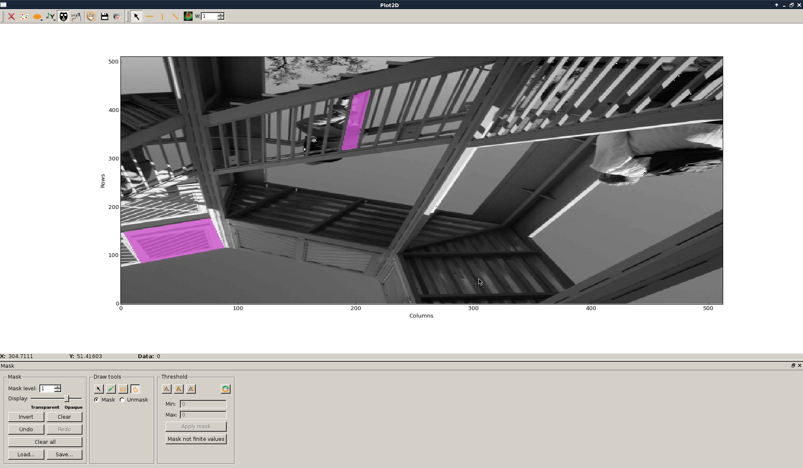
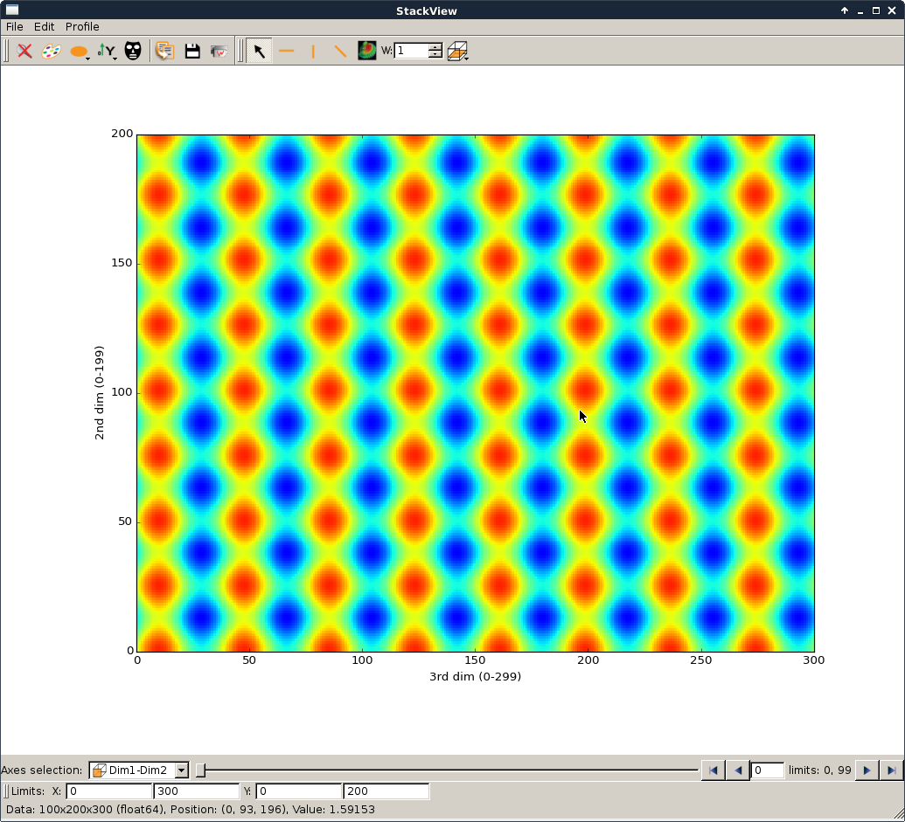
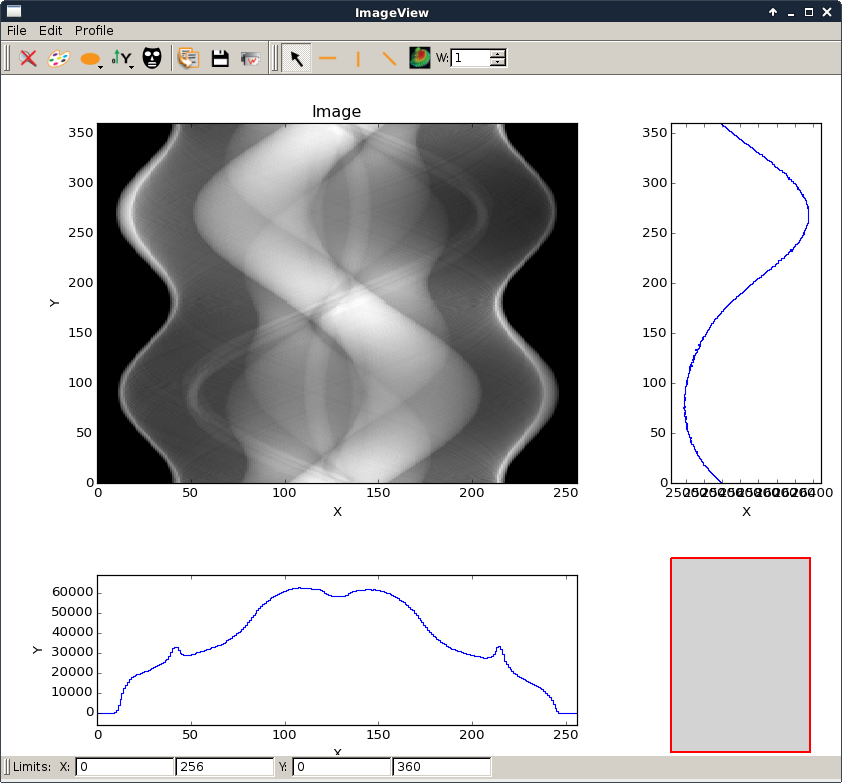

.. raw:: html

   <!-- Patch landslide slides background color --!>
   

Plot
####

----

silx.gui.plot.Plot1D
====================

.. _Plot1D: http://www.silx.org/doc/silx/dev/modules/gui/plot/plotwindow.html#silx.gui.plot.PlotWindow.Plot1D

- draw curves, histograms, select colormap, scales, etc...
- documentation : Plot1D_
- tutorial : http://www.silx.org/doc/silx/dev/modules/gui/plot/getting_started.html
- hands on (silx-training/silx/plot/Plot1DExercise)

.. image:: img/Plot1D.png
   :width: 60%
   :align: center

----

silx.gui.plot.Plot2D
====================

.. _Plot2D: http://www.silx.org/doc/silx/dev/modules/gui/plot/plotwindow.html#silx.gui.plot.PlotWindow.Plot2D

- exercise : silx-training/plot/Plot2DExercise.ipynb
- documentation : Plot2D_
- tutorial : http://www.silx.org/doc/silx/dev/modules/gui/plot/getting_started.html
- demo / hands on (silx-training/silx/plot/Plot2DExercise)

.. image:: img/Plot2D.png
   :width: 60%
   :align: center

----

Mask
====

- can be saved/loaded
- demo

----

silx.gui.plot.PlotAction
========================

- useful to add features into a PlotWindow
- exercise : silx-training/plot/PlotInteractionExercise
- documentation : http://www.silx.org/doc/silx/dev/modules/gui/plot/plotactions_examples.html
- example : see silx/examples/shiftPlotAction.py

----

silx.gui.plot.StackView
=======================

- display 3D volume as a stack of 2D images
- example code source : profile 1D, 2D : dimensions
- demo

----

imageview
=========

- imageview
    + script to display an image in an ImageViewMainWindow
    + script in silx/examples/imageview.py

    
.. ----

.. - PeriodicTable

..    + allows (multiple) selection of physical elements from Mendeleïev table
..    + sample code : see silx/examples/periodicTable.py

.. .. image:: img/periodicTable.png
..    :width: 60%
..    :align: center

.. ----

.. - silx.gui.data.ArrayTableWidget

..     + display data arrays with any number of dimensions as 2D frames (images, slices) in a table view. The dimensions not displayed in the table can be browsed using improved sliders.

.. .. image:: img/arrayTableWidget.png
..    :width: 60%
..    :align: center    

.. ----

.. .. code-block:: python

..     import numpy
..     a = qt.QApplication([])
..     d = numpy.random.normal(0, 1, (4, 5, 1000, 1000))
..     for j in range(4):
..         for i in range(5):
..             d[j, i, :, :] += i + 10 * j
..     w = ArrayTableWidget()
..     w.setArrayData(d, labels=True)
..     w.show()
..     a.exec_()

