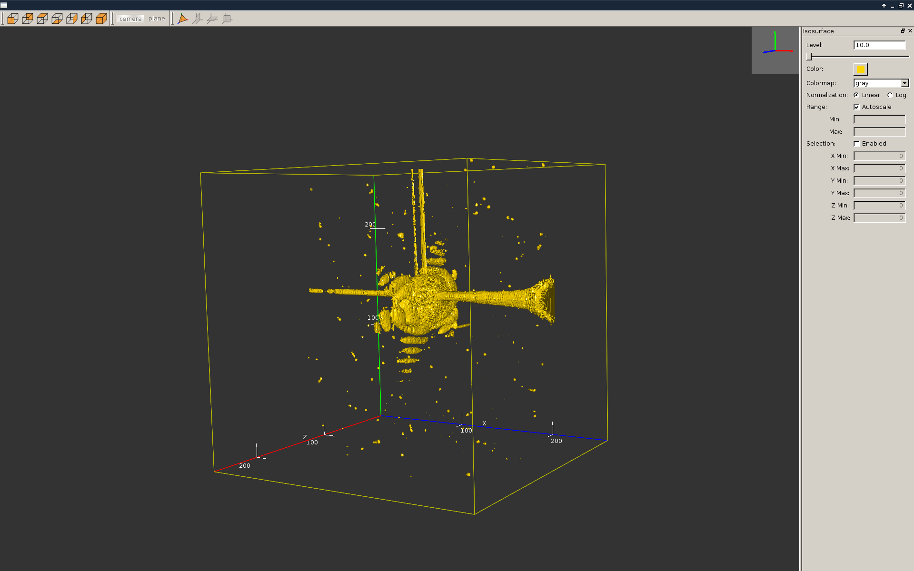
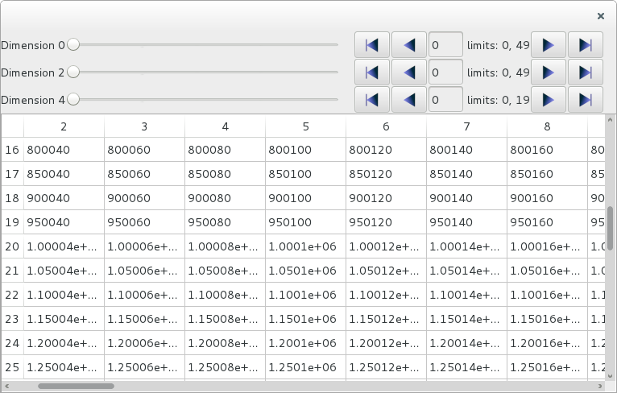

silx Training - 15th November, 2016
###################################

Authors:
    - pierre.knobel@esrf.fr
    - valentin.valls@esrf.fr
    - henri.payno@esrf.fr
    - jerome.kieffer@esrf.fr
    - thomas.vincent@esrf.fr
    - sole@esrf.fr

.. image:: img/silx_logo.png
    :width: 180px
    :height: 280px

----

Overview of the silx project
############################

----

.. todo:: general stuff, for scientist, python 2 and 3, crossplatform...

Documentation of releases is available at https://pythonhosted.org/silx/

Latest documentation (nightly build) is available at http://www.silx.org/doc/silx/

    - silx@esrf.fr

----

silx project
############

.. image:: img/silx_project.jpg
    :width: 700px
    :height: 600px

----

time scale
##########

- 2014: 
    - Structure of the project
- 2015: 
    - May: acceptation of the project within the EBS
    - December: 1st engineer & 1st scientist
- 2016:
    - January: 2nd engineer & 2nd scientist
    - March: First release: silx v0.1
    - May: 3rd engineer
    - July: silx v0.2
    - October: silx v0.3
    - November: Training for scientists

----

Structure of the silx library
#############################

Graphical User Interface widget
-------------------------------
    Plot, image display, mask, HDF5 tree view, fit configuration

Image processing tools
----------------------
    Image interpolation, registration and drawing primitives

Input / Output
--------------
    Support for spec, HDF5 and image formats

Math
----
    Least-squares fit, volume isosurface, histograms, ...

OpenCL
------
    Parallel computing on GPU

Third-Party external utilities
------------------------------
    Currently *TiffIO*, *six* and *EdfFile*

Utils
-----
    Various utility functions (HTML escaping, weak-references)

Sx
---
    Imports all silx in one go: aim at replacing pylab

----

Plot
####

.. image:: img/plots.png
    :width: 750px
    :height: 280px

plot1D
-------
    hands-on \
    silx.gui.plot.Plot1D

plot2D
------
    hands-on \
    silx.gui.plot.Plot2D

image
-----

plot3D
------
    to come soon

----

Plot
####

+ backends 
    + matplotlib
    + openGL
+ plot actions
+ mask
+ ROI
+ interaction from a qt console

----

Marching cubes - silx.math
##########################

algorithm to generate mesh from a set of iso-vertices

http://paulbourke.net/geometry/polygonise/

Visualization from isoViewer ( prototype status for now. Will be soon integrated into silx )

----

silx.image
##########

bilinear interpolation:
convert an image to a continuous function.

sift: image alignement, using parallel algorithms on GPU

----

silx.math
#########

histogram
---------
'classical' histogram. Able to a compute distribution of a dataset.

- histogramnd (hands-on) : (N, ) or (N, D) array
    + silx.math.histogram.Histogramnd
- histogramnd_lut : (N, ) or (N, D) array
    + silx.math.histogram.HistogramndLut

        .. note:: the same as histogramnd but use a look up table (useful if multiple assocaition are needed )

----

OpenCL
######

opencl integration
------------------

Many function and setup to facilitate the integration of pyopencl in silx throught different platform (windows, linux, mac).
    - computation of possible kernels size
    - test of opencl platforms
    - ...

First functions using pyopencl 
    - sift
        + silx.image.sift

----

Upcoming features
#################

fabioh5
-------

Exposing all data files handled by FabIO, the same way as *h5py* and *spech5*.

.. code-block:: python

    import silx.io.fabioh5
    f = silx.io.fabioh5.File("foobar.edf")

ArrayWidget
-----------

Editing 2D data-slices in a N-dimensional array

----

This was the first silx tutorial. Please let use know about any ideas to improve it !!!

And if you want to contribute to the project : 

.. image:: img/forkme.png
    :align: center
    :target: https://github.com/silx-kit/silx

----

Authors
