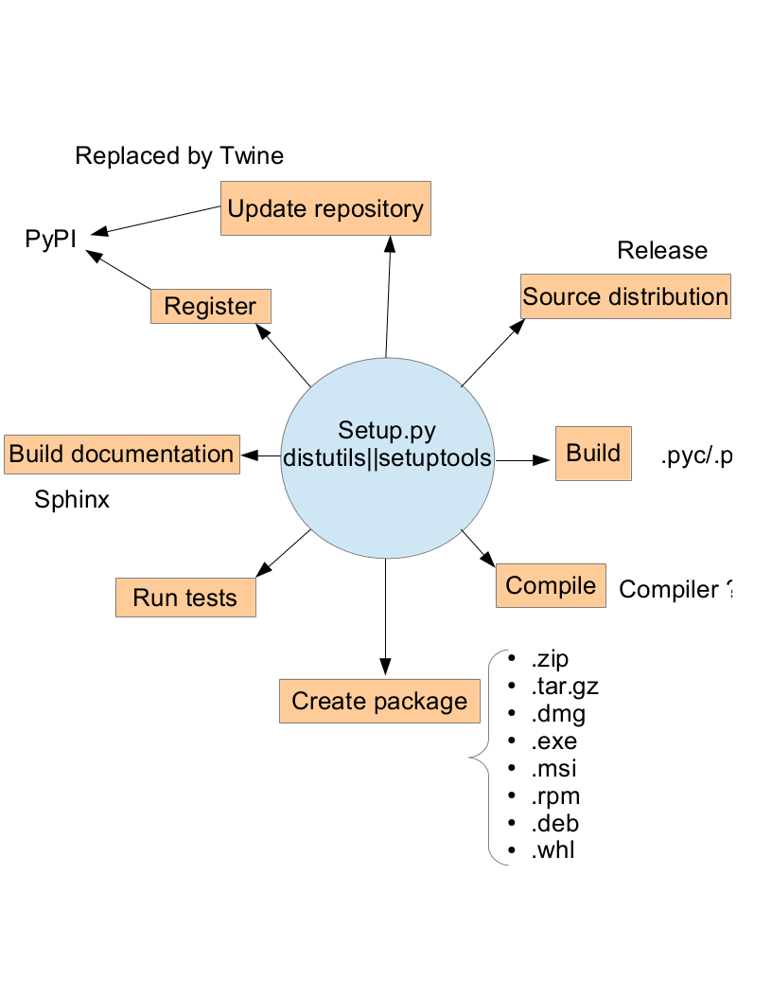
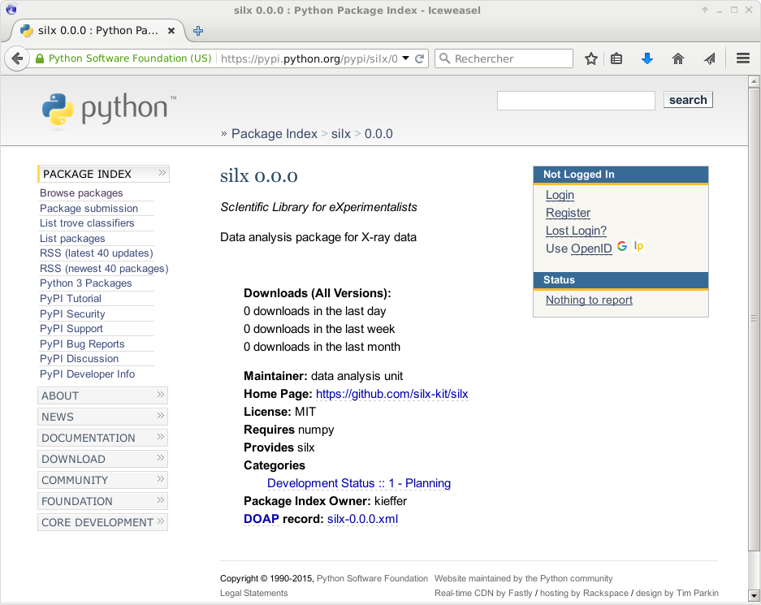

.. raw:: html

   <!-- Patch landslide slides background color --!>
   

Distribute Python software
==========================

Outline
-------

#. setup.py and setuptools
#. Management of dependencies
#. Packages: wheels & deb
#. Fat binaries

References:

* https://python-packaging-user-guide.readthedocs.org/en/latest/
* https://docs.python.org/3.5/distutils/index.html

---------------

The core of the distribution: *setup.py*
----------------------------------------

----

*setup.py*
----------

This *setup.py* is basically a call to the setup function provided by distutils or
setuptools (the later being preferred)

The next slides will present you an incremental way to make from scratch the
*setup.py* for your project.

For now, just import the setup function for setuptools or distutils:

.. code-block:: python
   try:
       from setuptools import setup
   except ImportError:
       from distutils.core import setup

   setup(name='silx',
         version='0.0.1',
         )

https://docs.python.org/3.5/distutils/apiref.html

---------------

Registration
------------

The central registration point is the Python Package Index `PyPI <http://pypi.python.org>`_

---------------

Actual registration (1/2):
--------------------------
Add information about the author, emails and classifiers like:

.. code-block:: python

   setup(name='silx',
         version='0.0.1',
         url="https://github.com/silex-kit/silx",
         author="data analysis unit",
         author_email="silx@esrf.fr",
         classifiers = ["Development Status :: 1 - Planning",
                        "Environment :: Console",
                        "Environment :: MacOS X",
                        "Environment :: Win32 (MS Windows)",
                        "Environment :: X11 Applications :: Qt",
                        "Intended Audience :: Education",
                        "Intended Audience :: Science/Research",
                        "License :: OSI Approved :: MIT License",
                        "Natural Language :: English",
                        "Operating System :: Microsoft :: Windows",
                        "Operating System :: POSIX",
                        "Programming Language :: Cython",
                        "Programming Language :: Python",
                        "Programming Language :: Python :: Implementation :: CPython",
                        "Topic :: Documentation :: Sphinx",
                        "Topic :: Scientific/Engineering :: Physics",
                        "Topic :: Software Development :: Libraries :: Python Modules",
                        ]

         )

---------------

Actual registration (2/2):
--------------------------

.. code-block:: shell
    python setup.py register

All information should now be availabe online.
It is advised to separate classifiers in a dedicated list.

List of available `classifiers <https://pypi.python.org/pypi?%3Aaction=list_classifiers>`_

---------------

Define your package (1/3)
-------------------------

Create a directory of the name of your package and a *__init__.py* file in it.

::

  project/
     |---- setup.py
     |---- package/
     |       |----- __init__.py

---------------

Define your package (2/3)
-------------------------

Modify your setup.py accordingly.

.. code-block:: python

   setup(name='silx',
         version='0.0.1',
         url="https://github.com/silex-kit/silx",
         author="data analysis unit",
         author_email="silx@esrf.fr",
         classifiers = classifiers,
         description="Software library for X-Ray data analysis",
         packages=["silx", "silx.io", "silx.third_party", "silx.visu"],
         )

In this example the *io*, *third_party* and *visu* sub-packages have also been
declared.

----

Define your package (3/3)
-------------------------

You can now build your module with:

.. code-block:: shell

    python setup.py build

From now on, you should be able to:

Create a source package with:
.............................
.. code-block:: shell

    python setup.py sdist

Install your package with
.........................
.. code-block:: shell

    python setup.py install

Create a binary package with
............................
.. code-block:: shell

    python setup.py bdist

And alos binary packages can be *exe* and *msi* under Windows, *zip* under MacOSX,
*tar.gz* or *rpm* under linux, ...

Nota:
.....
Only python files will be part of your source package for now.
If you want to include additionnal files (like README, ...)
declare them in the *MANIFEST.in*.

---------------

Dependencies
------------

Dependency management is available at 3 different levels:

* from setuptools
* from PIP requirement file
* from Debian packages

Dependencies allow the user to know what other library is required.
Those requirement can be build requirement or use requirement:
*install_requires* and *setup_requires*:

.. code-block:: python

   install_requires = ["numpy", "h5py"]
   setup_requires = ["numpy", "cython"]

   setup(name='silx',
         version=get_version(),
         url="https://github.com/silex-kit/silx",
         author="data analysis unit",
         author_email="silx@esrf.fr",
         classifiers = classifiers,
         description="Software library for X-Ray data analysis",
         long_description=get_readme(),
         packages=["silx", "silx.io", "silx.third_party", "silx.visu"],
         install_requires=install_requires,
         setup_requires=setup_requires,
         )

---------------

*setup.py* dependency vs *requirement.txt*
..........................................

It may look contradictory to define dependencies at different places
`but it is not <https://caremad.io/2013/07/setup-vs-requirement/>`_.

* *setup.py* provides an abstract dependency (i.e. h5py)
* *requirement.txt* provides concrete implementation (often with hard coded
   versions and URL to download wheels from).
  This is often organization specific or CI-tool specific: h5py==2.5.0

Dependencies defined in the setup.py are naturally propagated to packages (Debian, windows, ...)

---------------

Building packages
-----------------

Packages are the best way to distribute a library, regardless to the operating system.
For (graphical) application Fat-binaries may be a better choice, especially under Windows and MacOSX and will be discussed in next chapter

There are 2 kind of packages to be distinguished:

* Operating system packages: RPM, DEB, ...
* Python specific packages: Wheels (it obsoletes eggs)

Advantages of packaging tools:

* Keeps track of installed packages
* Management of dependencies
* Provides access to a package repository.

---------------

Wheels: `PEP427 <https://www.python.org/dev/peps/pep-0427/>`_
-------------------------------------------------------------

Wheels are the `new standard <http://pythonwheels.com/>`_ of python distribution
and have replaced *eggs*.

Advantages of wheels:

#. Faster installation for pure python and native C extension packages.
#. Avoids arbitrary code execution for installation. (Avoids setup.py)
#. Installation of a C extension does not require a compiler on Windows or OS X.
#. Allows better caching for testing and continuous integration.
#. Creates .pyc files as part of installation to ensure they match the Python interpreter used.
#. More consistent installs across platforms and machines.

They provide binary packages and a decent installer (pip) for Windows and MacOSX.

---------------

Building Wheels
---------------

You will need setuptools and wheel installed:

.. code-block:: shell

  apt-get install python-setuptools python-wheel

or:

.. code-block:: shell

  pip install setuptools wheel --user

then:

.. code-block:: shell

  python setup.py bdist_wheel

Pitfalls:
---------
External shared library (Qt, hdf5, ...)

You can use the `delocate <https://github.com/matthew-brett/delocate>`_ utility
on MacOSX to check which libraries your package is linked against.

TODO: Under Windows: depends 

.. For example, this is the result of running delocate-listdeps --all on a binary wheel for the pyqt library:

---------------

Debian packages
---------------

To build debian packages we recommend an additionnal tool: *stdeb*

.. code-block:: shell

   sudo apt-get install python-stdeb python3-stdeb
   
   python setup.py --command-packages=stdeb.command bdist_deb

You should find your python-*package**.deb in deb_dist directory.

stdeb can be configured with an additionnal file: *stdeb.cfg*

To build both Python2 & Python3 packages use:

.. code-block:: shell

   python3 setup.py --command-packages=stdeb.command sdist_dsc --with-python2=True --with-python3=True --no-python3-scripts=True bdist_deb

`Alternative to be considered <https://github.com/p1otr/pypi2deb>`_

------

.. include:: fat_binaries.rst
