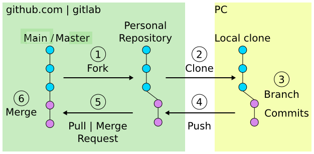

.. raw:: html

   <!-- Patch landslide slides background color --!>
   <style type="text/css">
   div.slide {
       background: #fff;
   }
   </style>

GIT
===

Presenter Notes
...............

- Linus Torvalds
- 2005
- Naming: The name "git" was given by Linus Torvalds when he wrote the very first version. He described the tool as "the stupid content tracker" and the name as (depending on your way):

    - random three-letter combination that is pronounceable, and not actually used by any common UNIX command.
    - "global information tracker": you're in a good mood, and it actually works for you. Angels sing, and a light suddenly fills the room.
    - US, regional, slang (get)
    - "goddamn idiotic truckload of sh*t": when it breaks

----

Version Control System
----------------------

.. image:: http://www.phdcomics.com/comics/archive/phd101212s.gif
   :alt: Why use a version control system?
   :align: center
   :width: 400

Image from http://phdcomics.com/comics/archive_print.php?comicid=1531


Presenter Notes
...............

- preserve you of losing modifications

----

Git version control
-------------------

Git is the current (2019) standard, it has replaced SVN, CVS, ...

If you have heard of any of them, the concepts in Git are similar while offering a lot of flexibility.

wikipedia definition:

 `Git is a distributed version-control system for tracking changes in source code during software development. It is designed for coordinating work among programmers, but it can be used to track changes in any set of files. Its goals include speed data integrity, and support for distributed, non-linear workflows`

Presenter Notes
...............

Mercurial is the main concurrent of git with a close design.
Mercurial seems simpler but a little less powerful (API). Git seems to have less 'corner cases'.
CVS: concurrent version system
SVN: Apache Subversion

----


github and gitlab
-----------------

**github.com** and **gitlab.esrf.fr** provides git-hosting for project and
encourage collaboration using forks of projects.

The main advantages are:

* simplify contribution.
* many tutorials for `gitHub <https://guides.github.com/>`_ and `gitlab <https://docs.gitlab.com/ee/gitlab-basics/>`_.
* web page hosting for projects.
* over the years a cluster of services have pop up to help developers like `Travis <https://github.com/marketplace/travis-ci>`_ and `AppVeyor <https://github.com/marketplace/appveyor>`_).
* `offer a fixed pipeline based on *Pull request* <https://help.github.com/articles/using-pull-requests/>`_.
* lead to some 'normalization' of projects.

----

github vs gitlab
````````````````

* github should bring to your project an `Higher visibility compared to other hosting (in 2017) <http://software.ac.uk/resources/guides/choosing-repository-your-software-project>`_.
* github is usually one step ahead of gitlab regarding features and usability.
* activities on github are monitored by head-hunters and can be useful for professional placement.
* gitlab allows you to select a privacy level for your projects. Public projects can be seen from outside: https://gitlab.esrf.fr/public not private projects.
* github is free for open-source project.
* github has been acquire by Microsoft in 2018 for 7.5 billion dollars

.. image:: images/gitlab_privacy.png
    :align: center

Presenter Notes
...............

The amount of the acquirement by Microsoft show the importance of github on the today life of the developer.
As a consequence thousands of project has move from github to gitlab. (50000 after a week)

----

Different types of workflow
---------------------------

git permits several workflows:

* `centralized workflow  <https://www.atlassian.com/git/tutorials/comparing-workflows#centralized-workflow>`_
* `feature branch workflow <https://www.atlassian.com/git/tutorials/comparing-workflows/feature-branch-workflow>`_
* `gitflow workflow <https://www.atlassian.com/git/tutorials/comparing-workflows/gitflow-workflow>`_
* `forking workflow <https://www.atlassian.com/git/tutorials/comparing-workflows/forking-workflow>`_


Presenter Notes
...............

- centralized : a single point of entry 'central repository'. Let each users to deal with synchronization
- feature branch workflow: each new feature should take place in a dedicated branch
- gitflow : strict management of branches designed for releases. One branch per:
    - releases
    - each feature
    - fix

----

forking workflow
----------------

This is not the goal today to see the advantages of the different type of workflows.
But for the hands on session today we will focus in the 'forking workflow'.



Presenter Notes
...............

Why the 'forking flow' ? ==> commonly used. The one of silx for example.
The idea is that each developer can interact with other from his own fork.
Each developer can request to merge some modifications (feature, bug fix...) with others: this is a pull request

- simplify branch forking
- Always keep upstream branch ready for deployment with features and fixes
- Each new branch starts from the master (up to date)
- Use merge request for each new feature

----

Example: create a new git project
---------------------------------

This example presents how to create a git project from a single source file: polynom.py

.. note:: *For those which intend to create a new git project from existing source code you can follow the same procedure.*


To create the git project:

1. create an empty folder to start the new project

.. code-block:: bash

    mkdir pypolynom
    cd pypolynom

2. create the directory which will contains the source code file(s)

.. code-block:: bash

    mkdir pypolynom

3. add / copy your source code file(s)

.. code-block:: bash

    touch pypolynom/polynom.py


----

Example: create a new git project (2)
`````````````````````````````````````

4. init the git project file (from the root directory)

.. code-block:: bash

    git init

5. create a new project from `gitlab <http://gitlab.esrf.fr/>`_ or `github <http://github.com/>`_


6. you can now register the gitlab / github project url to the current git project

.. code-block:: bash

    git remote add origin git@gitlab.esrf.fr:silx/silx-trainings/pypolynom.git

7. add files to a commit (detail later)

.. code-block:: bash

    git add <file1> <file2> ... <folder1> ...
    git commit

8. push modifications (detail later)

.. code-block:: bash

    git push origin master

----

Hands on: fork an existing project
----------------------------------


Now each person will create his personal repository of the project.


----

Hands on: fork an existing project
``````````````````````````````````

1 fork the project from the webinterface of gitlab or github.

    1.1 login to github / gitlab

    1.2 look for the 'https://gitlab.esrf.fr/silx/silx-trainings/pypolynom_completed' project

    1.3 fork the project and go to the homepage of the fork you just created

.. include:: <isonum.txt>

|rarr| This will provide you an url to your personal repository.

.. class:: center

    |fork-gitlab| |fork-github|


.. |fork-github| image:: images/github-fork.png
   :width: 45%


2. clone the project:

.. code-block:: bash

    git clone git@gitlab.esrf.fr:[my_id]/pypolynom_completed.git

|rarr| You are now ready for making some modifications and share them with others.

----

branches
--------

**master** branch: default / 'main' branch.

|rarr| We will consider the case where each new features, bug fix or improvements are developed in a dedicated branch.

|rarr| The history of a branch is a collection commits.

|rarr| Two branches can be merge together.

.. image:: images/git_branch.png
    :align: center


Presenter Notes
```````````````

Eah commit has an 'ID': SHA-1 checksum from modifications + commit message + author + date


----

Branches commands
`````````````````

* *git checkout <branch>* : move to another branch.
* *git checkout -b <branch>* : create a new branch
* *git merge <branch>* : merge history of <branch> into the current branch
* *git fetch <branch>* retrieve history from another branch

Note : *pull* command is grouping *fetch* and *merge*


Presenter Notes
...............

Default parameters are usually origin/master

TODO: make a small demo of how to move from one branch to an other...

----

Git actions
-----------

To made modification locally you will have to follow the current process:

1. *git add* files to the list of tracked files
2. *git commit* the files, locally
3. *git push* your changes to a remote repository

The cycle 1-2-3 is the normal development cycle for a local project.

Any git repository contains all the history of the project, i.e all
commits with authors, data time, file changed, and the chain of commits called *branch*


.. note:: *graphic tools as* `git-gui <https://git-scm.com/docs/git-gui>`_ *and* `gitk <https://git-scm.com/docs/gitk>`_ *might help you for commits and to have a graphic representation of the tree view.*

----

Some useful git commands
------------------------

* *git status* : show the working tree status (branch name, file modified, added...)
* *git log* : show commits logs
* *git diff* : show changes between commits
* *git tag* : add a tag at a specific point of the history

----

Presenter Notes
...............

git tag can help you to retrieve some milestone
git reflog

Hands on: propose modifications
-------------------------------

For this exercise you can use a `git Cheat sheet <https://education.github.com/git-cheat-sheet-education.pdf>`_ if you like.

Now we want to make some modifications on the source code (for a bug fix for example).
We need to:

* create a new branch relative to the bug fix
* make some modifications on the source code
* create a commit of the modifications
* push the new branch to your personal repository
* create a pull / merge request to the original github / gitlab repository

----

Hands on: propose modifications (2)
```````````````````````````````````


1. create a new branch branch_my_name

.. code-block:: bash

    git checkout -b branch_my_name

2. Then modify the source code (create a new function, add some documentation...)

...

once done you can check the current status of your project

.. code-block:: bash

    git status ./

3. create your first commit:
    * add the modifications you want to embed
    * create a commit


.. note:: a .gitignore file can help you to specify files to untrack.

----

Hands on: propose modifications (3)
```````````````````````````````````

Now we want to merge those modifications into the original gitlab/github repository.


4. Push those modifications on your personal repository.

.. code-block:: bash
    git push origin <branch>

you can now see the branch on your personal directory.

.. image:: images/new_branch_git_push.png
    :align: center
    :width: 40%

----

Hands on: propose modifications (4)
```````````````````````````````````


5. connect you to your personal repository and from the web interface create a merge request to the original gitlab / github repository.


.. image:: images/create_merge_request.png
    :align: center
    :width: 65%

|

.. image:: images/merge_request_1.png
    :align: center
    :width: 80%

|


6. You can ask someone to review your code and merge your PR

----


Git - Interact with a third repository
--------------------------------------

To interact with a remote repository from a local clone :

* *git remote* : manage tracked repositories
* *git remote add name url* : Adds a remote named <name> for the repository at <url>

.. note:: all this information is stored in .git/config file

Then you can retrieve commits from those repositories:

* *git fetch <repository> <branch>* retrieve history from another branch
* *git merge <repository>/<branch>* : merge history of <branch> into the current branch

The cycle 1-2 is the normal cycle to retrieve commits.


Presenter Notes
...............

git actions have defaults parameters in order to simplify commands and to fit sith workflows
For example *fetch* and *merge* have default values for:

- repository --> origin
- branch  --> master

----

Hands on: retrieve modifications
--------------------------------

We now want to keep the clone up to date. To get our modifications and more importantly,
the one from the other developers.

1. add a remote repository

.. code-block:: bash

    git remote add upstream git@gitlab.esrf.fr:silx/silx-trainings/pypolynom.git
    # git remote add co-worker git@gitlab.esrf.fr:<co-worker>/pypolynom.git

2. merge those modification on your master branch

.. code-block:: bash

    git checkout master
    git merge upstream/master

or

.. code-block:: bash

    git checkout master
    git fetch upstream <branch>
    git merge upstream/master


you are now ready for a new development cycle.

----

Some tutorials and utils for git/github
---------------------------------------

* `Comprehensive tutorial <http://gitref.org>`_
* `Cheat sheet from Github <https://education.github.com/git-cheat-sheet-education.pdf>`_
* `simple Cheat sheet <http://rogerdudler.github.io/git-guide/files/git_cheat_sheet.pdf>`_
* `list of default .gitignore for several languages <https://github.com/github/gitignore>`_

----

Contribution in OSS
-------------------

If your project becomes popular, you may have external contributors...
or you might want to contribute to other projects.

How to contribute to an Open Source project is presented in
`this document <http://scikit-image.org/docs/stable/contribute.html>`_
for scikit-image.
