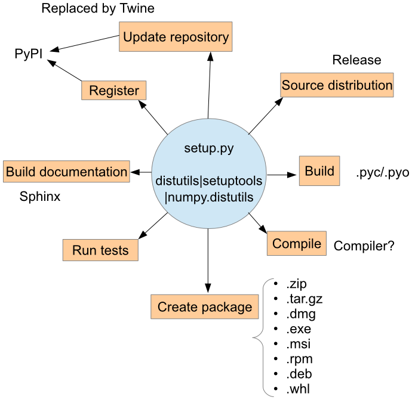
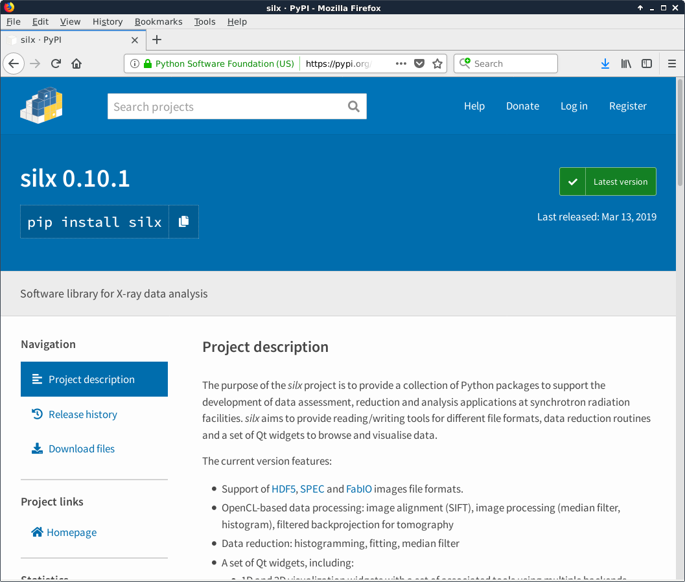

.. raw:: html

   <!-- Patch landslide slides background color --!>
   

Distribute Python software
==========================

Objectives
----------

Build, install, package and distribute Python code

References:

* https://packaging.python.org/tutorials/packaging-projects/
* https://setuptools.readthedocs.io/en/latest/
* https://github.com/pypa/sampleproject

----

Outline
-------

#. setup.py and setuptools:

   #. The basic
   #. Dependencies
   #. Metadata and distribution with PyPI

#. Additional features

   #. Additional resources
   #. Entry points
   #. Binary extensions
   #. numpy.distutils

#. A word on packages: Wheels, Debian, Fat binaries

----

First, make a package
---------------------

Create a directory with the name of your package and a *__init__.py* file in it.

::

  project/
      package/
          __init__.py
          module.py
          subpackage/
              __init__.py
          ...

Often the *project* and the *package* names are the same.

So that, from the ``project`` directory:

.. code-block:: python

   >>> import package
   >>> from package import module
   >>> import package.subpackage

----

The core of the distribution: *setup.py*
----------------------------------------

As *setup.py* used to be doing to many things, other tools have been added:
*pip* (the official Python package installer) and
*twine* (for uploading distributions to PyPI).

----

The core of the distribution: *setup.py*
........................................

::

  project/
      setup.py
      package/
          __init__.py

To handle package distribution, *setup.py* relies on the ``setuptools`` package.

The *setup.py* is basically a call to the ``setuptools.setup`` function providing the description of the Python package:

.. code-block:: python

   # coding: utf-8
   from setuptools import setup

   setup(...)

The next slides will present you an incremental way to make from scratch the
*setup.py* for your project.

----

*setup.py*: The bare minimum
............................

.. code-block:: python

   from setuptools import setup, find_packages

   setup(name='package',
         version='0.0.1',  # https://www.python.org/dev/peps/pep-0440/
         packages=['package', 'package.subpackage'],
         # or 
         # packages=find_packages(exclude=[]),
         )

For::

  project/
      package/
          __init__.py
          module.py
          subpackage/
              __init__.py

Note:
For a single file project (e.g., ``module.py``), use:

.. code-block:: python

  py_modules=["module"] # instead of packages=...

----

*setup.py*: The bare minimum
............................

Even if some information is still missing, you can already:

Build your package with:
++++++++++++++++++++++++

.. code-block:: shell

    python setup.py build

Install your package with:
++++++++++++++++++++++++++

.. code-block:: shell

    pip install .
    # deprecated: python setup.py install

and even::

  pip install git+https://gitlab.esrf.fr/silx/pypolynom.git

Create a source package with:
+++++++++++++++++++++++++++++

.. code-block:: shell

    python setup.py sdist

Create a binary package with:
+++++++++++++++++++++++++++++

.. code-block:: shell

    python setup.py bdist_wheel

----

Source package content: *MANIFEST.in*
.....................................

A default set of files (\*.py, README.rst,...) is included in source packages produced by::

  python setup.py sdist

It is possible to include additional files by declaring them in a ``MANIFEST.in`` file at the project's top-level::

  include LICENSE
  include README.rst
  recursive-include package_name *.pyx

----

*setup.py*: Requirements (1/2)
..............................

Dependencies allow the user and installation system to know other required packages.

Those requirements can be build requirements or installation requirements:
*install_requires* and *setup_requires*:

Describe package dependencies:

.. code-block:: python

  setup(...
        python_requires='>=3.4',
        setup_requires=['setuptools', 'wheel'],
        install_requires=['numpy>=1.8'],
       )

Dependencies defined in the *setup.py* are propagated to binary packages (wheels, Debian...)

Syntax: `PEP508 <https://www.python.org/dev/peps/pep-0508/>`_

----

*setup.py*: Requirements (2/2)
..............................

Optional:
The ``extras_require`` argument allows to define optional dependencies:

.. code-block:: python

  setup(...
        extras_require={
            'doc': ['sphinx'],
        },
       )

It is then possible to install those extra dependencies with::

  pip install package[doc]

----

*setup.py* vs *requirement.txt*
...............................

It may look contradictory to define dependencies at different places
`but it is not <https://packaging.python.org/discussions/install-requires-vs-requirements/>`_.

* *setup.py* provides an abstract dependency (e.g., ``numpy``)
* *requirement.txt* provides concrete implementation (with hard coded
  versions and URL to download wheels from).
  This is provides a way to specify an environment: ``numpy==1.12.0``

  Usage::

      pip install -r requirements.txt

----

*setup.py*: Metadata (1/3)
..........................

.. code-block:: python

  setup(...
        description='Sample project for distribution training',
        long_description=long_description,
        url='https://gitlab.esrf.fr/silx/trainingproject',
        classifiers=classifiers,
        author='Someone',
        author_email='someone@somewhere.org',
        # keywords='',
        project_urls={
            'Issues': 'https://gitlab.esrf.fr/silx/trainingproject/issues',
            }
        )

----

*setup.py*: Metadata (2/3)
..........................

Definition of the list of project's classifiers:

.. code-block:: python

  classifiers = [
      'Development Status :: 3 - Alpha',
      'Intended Audience :: Education',
      'License :: OSI Approved :: MIT License',
      'Natural Language :: English',
      'Operating System :: MacOS',
      'Operating System :: Microsoft :: Windows',
      'Operating System :: POSIX',
      'Programming Language :: Python :: 3',
      'Programming Language :: Python :: 3.4',
      'Programming Language :: Python :: 3.5',
      'Programming Language :: Python :: 3.6',
      'Programming Language :: Python :: 3.7',
      ]

Available classifiers: https://pypi.org/classifiers/

----

*setup.py*: Metadata (3/3)
..........................

If a README file is available, it can be reused as the ``long_description``:

.. code-block:: python

  import io, os

  def get_readme():
      dirname = os.path.dirname(os.path.abspath(__file__))
      filename = os.path.join(dirname, "README.rst")
      with io.open(filename, "r", encoding="utf-8") as fp:
          long_description = fp.read()
      return long_description

Similarly, there are different ways to define the ``version`` number at a unique place:
https://packaging.python.org/guides/single-sourcing-package-version/

---------------

Distribution (1/2)
..................

The central registration point is the Python Package Index `PyPI <https://pypi.org/>`_

---------------

Distribution (2/2)
..................

This requires the ``twine`` package (``pip install twine``).

- First, create an account on [test.]PyPI: `https://[test.]pypi.org/account/register/ <https://test.pypi.org/account/register/>`_

- Generates the packages you want to provide (check the version number, and tag it in git)::

  python setup.py sdist bdist_wheel

- Upload the project with ``twine``::

  twine upload [--repository-url https://test.pypi.org/legacy/] dist/*

- Install from [test.]PyPI::

  pip install [--index-url https://test.pypi.org/simple/ --extra-index-url https://pypi.org/simple] package 

----

Additional features
-------------------

----

Entry points
............

Allows to define functions that are available as commands once installed.
It provides a cross-platform automatic script creation mechanism (i.e., produces .exe files on Windows and scripts on other OS).

.. code-block:: python

   setup(...
         entry_points={
             'console_scripts': [
                 'package-script = package:main'],
             'gui_scripts': [
                 'package-gui = package.gui:main']
             },
         )

Will create a ``package-script`` and a ``package-gui`` command-line scripts during installation.

----

Additional resources
....................

.. code-block:: python

   setup(...
         # Files to install within the package
         package_data={
             'package': ['*.dat'],
             },
         # Files to install outside of the package
         data_files=[('data', ['data/data.dat'])],  # List of (directory, files)
        )

See `package_data <https://docs.python.org/3/distutils/setupscript.html#installing-package-data>`_ and
`data_files <https://docs.python.org/3/distutils/setupscript.html#installing-additional-files>`_ documentation.

----

Compiled extensions
...................

It is possible to compile modules written in C, C++, Cython as part of the build process.

.. code-block:: python

   from setuptools.extension import Extension

   setup(...
         ext_modules=[
             Extension('package.cmodule', ['package/cmodule.c'])],
             Extension('package.cythonmodule', ['package/cmodule.pyx'])
             ],
        )

This adds the requirement of having the proper compiler available... and put a lot more constraint on packaging and distribution.

----

*setup_requires*: chicken-egg issue
...................................

It is possible to define build requirements (i.e., ``setup_requires``) outside the ``setup.py`` file (See `PEP518 <https://www.python.org/dev/peps/pep-0518/>`_) in a ``pyproject.toml``::

  [build-system]
  requires=['setuptools', 'wheel', 'cython']

------

Advanced setup.py: numpy.distutils
..................................

`numpy.distutils <https://docs.scipy.org/doc/numpy/reference/distutils.html>`_ provides a way to use a hierarchy of setup.py::

  project/
    setup.py  -> Effective setup.py
    package/
      __init__.py
      setup.py      -> Handles main package build
      subpackage/
        __init__.py
        setup.py    -> Handles subpackage build

- Pros: Each sub-package is embedding its own build.
- Cons: ``numpy`` becomes a build dependency.

This is based on the `Configuration class <https://docs.scipy.org/doc/numpy/reference/distutils.html#numpy.distutils.misc_util.Configuration>`_.

----

A word on packages
------------------

Packages are the best way to distribute a library, regardless of the operating system.
For (graphical) applications, fat-binaries may be a better choice, especially under Windows and macOS.

There are different of packages to be distinguished:

* Operating system packages: RPM, DEB, MSI, ...
* Python specific packages: Wheels
* Conda packages

Advantages of packaging tools:

* Keeps track of installed packages
* Management of dependencies
* Provides access to a package repository.

---------------

Wheels: `PEP427 <https://www.python.org/dev/peps/pep-0427/>`_
.............................................................

Wheels are the `current standard <http://pythonwheels.com/>`_ of python distribution.

Advantages of wheels:

#. Avoids arbitrary code execution for installation (no *setup.py* executed).
#. Does not require a compiler on the client side for binary extensions.
#. Faster installation, especially for binary extensions.
#. Allows better and faster testing and continuous integration.
#. Creates *.pyc* files at installation, matching the Python interpreter used.
#. More consistent installs across platforms and machines.

Wheels provide binary packages and a decent installer (pip) for Windows and macOS.
Under Linux, the reference platform (*manylinux1* aka *centos5*) is very old and binary wheels are much slower than native builds (~20%).
Yet it is a very convenient way to install recent versions.

----

Building Wheels
...............

You will need ``setuptools`` and ``wheel`` installed::

  apt-get install python3-setuptools python3-wheel

or::

  pip install --upgrade setuptools wheel [--user]

then::

  python3 setup.py bdist_wheel

----

Building Wheels: Pitfalls
.........................

- For compiled extension, a specific version of the compiler is required (e.g., ``manylinux`` = *centOS 5* under Linux). See `Building binary extensions doc <https://packaging.python.org/guides/packaging-binary-extensions/#building-binary-extensions>`_.
- External shared library (e.g., Qt, hdf5, ...) needs to be incorporated in the wheel.
  You can use utility software to check which libraries your package is linked against:

  - macOS: `delocate <https://github.com/matthew-brett/delocate>`_
  - Windows: `depends <http://www.dependencywalker.com/>`_
  - Linux: ldd, `auditwheel <https://github.com/pypa/auditwheel>`_

---------------

Debian packages
...............

To build debian packages we recommend an additional tool: `stdeb <https://pypi.python.org/pypi/stdeb/>`_

.. code-block:: shell

   sudo apt-get install python3-stdeb
   
   python3 setup.py --command-packages=stdeb.command bdist_deb

You should find your python3-*package**.deb in deb_dist directory.

stdeb can be configured with an additionnal file: *stdeb.cfg*

Alternative to be considered: `pypi2deb <https://github.com/p1otr/pypi2deb>`_

------

Fat binaries
------------

Standalone self-contained applications or installers.

- Include Python interpreter and all dependencies.
- Fits Windows and macOS application distribution, as unlike Linux they lack a dependency management tools.

Beware:

- Fat binaries are fat (~150 Mb for projects involving GUIs).
- You are redistributing (many) other people's work, so take care about licenses
  (e.g., ``numpy`` compiled with Intel's Math Kernel Library, ``PyQt`` has a GPL license).

----

Freezing
........

There is a number of tools to 'freeze' a Python application for distribution from an installation on a computer.

Principle:

- Analyze a script to find its dependencies (i.e., its imports).
- Collect all dependencies and python interpreter in a directory.
- Add a launcher and eventually bundle everything in a single file or installer.

----

Freezing issues
...............

- Those tools relies on rules specific to each package (``matplotlib``, ``numpy``) which needs to be updated when packages evolve.
- Analysis can miss some hidden imports.
- All runtime dependencies must be included (including external libraries wrapped by Python packages).
- Data files cannot be guessed and need to be explicitly added.

You must make sure it is stand-alone and includes everything required.
Test the result on a different computer than the one used for packaging.

----

Tools
.....

- `cx_Freeze <http://cx-freeze.readthedocs.org/>`_: Cross-platform
- `py2app <https://pythonhosted.org/py2app/>`_: macOS
- `PyInstaller <http://www.pyinstaller.org/>`_: Cross-platform

`Platypus <http://www.sveinbjorn.org/platypus>`_ (macOS),
`pynsist <https://pypi.python.org/pypi/pynsist>`_ (Windows),
`py2exe <https://pypi.python.org/pypi/py2exe/>`_ (Windows),
`bbFreeze <https://pypi.python.org/pypi/bbfreeze>`_ (Windows, Linux),
`pex <https://github.com/pantsbuild/pex>`_ (Linux, macOS)

On Windows, you can create an installer with a tool such as `NSIS <http://nsis.sourceforge.net/>`_.

