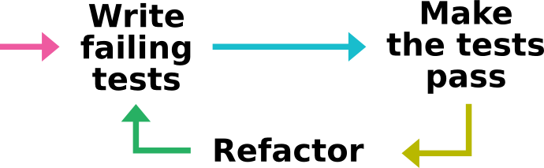
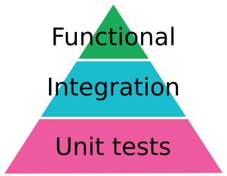

.. raw:: html

   

.. |br| raw:: html

    

Testing
=======

#. Introduction
#. Python `unittest` module
#. Additional tools
#. Continuous integration

------

What is it?
-----------

- A task consisting of checking that the **program** is working as expected
- Manually written **tests** which can be automatically executed
- Different methodologies: Always and before anything else (test-driven development, *TDD*, [TDDwithPython])

.. [TDDwithPython] `Harry J.W. Percival. Test-Driven Development with Python. O'Reilly 2014. <http://chimera.labs.oreilly.com/books/1234000000754>`_
  (Oriented towards web development).

Presenter Notes
...............

- Test inject input to the program, and check output
- Answer valid or not
- For maintenance: Reproduce bug in a test, then fix it.

----

Why testing?
------------

- Validate the code to the specifications
- Find problems early
- Facilitates change
- Documentation
- Code quality

  - Better design
  - Simplifies integration

----

Why not?
--------

- Extra work
- Not perfect
- Extra maintenance

  - More difficult to refactoring
  - Maintain environments

- Delays integration

Presenter Notes
...............

- 30% percent of the time of the project
- Having the structure set-up for testing encourages writing tests.
- Then... let's talk about the structure :-)

----

What kinds of tests?
--------------------

- **Functional tests**: Tests scripts, public API, GUI
- **Integration tests**: Tests components, code correctly integrated
- **Unit tests**: Tests independant pieces of code

.. [TestPyramid] Mike Cohn. Succeeding with Agile: Software Development Using Scrum. 2009.

Presenter Notes
...............

The test pyramid is a concept developed by Mike Cohn, described in his book "Succeeding with Agile"

- Unit tests (dev point of view, fast, low cost)
- Integration tests
- Functional tests (user point of view, but slow, and expensive)

- Cost: unit << integration << functional
- Fast to execute: unit >> integration >> functional

------

Where to put the tests?
-----------------------

Separate tests from the source code:

- Run the test from the command line.
- Separate test code when distributing.
- `... <https://docs.python.org/3/library/unittest.html#organizing-test-code>`_

Folder structure:

- In a separate `test/` folder.
- In `test` sub-packages in each Python package/sub-package,
  so that tests remain close to the source code.
  Tests are installed with the package and can be run from the installation.
- A `test_*.py` for each module and script (an more if needed).
- Consider separating tests that are long to run from the others.

------

Where to put the tests?
-----------------------

::

   project
      setup.py
      run_tests.py
      package/
          __init__.py
          module1.py
          test/
              __init__.py
              test_module1.py
          subpackage/
              __init__.py
              module1.py
              module2.py
              test/
                  __init__.py
                  test_module1.py
                  test_module2.py

Presenter Notes
...............

   scripts/
       my_script.py
       my_other_script.py
   test/
       test_my_script.py
       test_my_other_script.py

------

.. include:: unittest.rst

------

Extra tools
-----------

------

QTest
.....

For GUI based on `PyQt`, `PySide` it is possible to use Qt's `QTest <http://doc.qt.io/qt-5/qtest.html>`_.

It provides the basic functionalities for GUI testing.
It allows to send keyboard and mouse events to widgets.

.. code-block:: python

  from PyQt4.QtTest import QTest
  from PyQt4 import QtCore

  ...

  widget = ...

  QTest.qWaitForWindowShown(widget)
  QTest.mouseClick(widget, QtCore.Qt.LeftButton, pos=QtCore.QPoint(1, 1))
  QTest.keyClicks(widget, 'test', delay=100)  # Wait 100ms

  ...

Tighly coupled with the code it tests.
It needs to know the widget's instance and hard coded position of mouse events.

------

Test coverage
.............

Using `coverage.py <https://coverage.readthedocs.org>`_ to gather coverage statistics while running the tests:

#. Install `coverage.py` package: `pip install coverage`.
#. Run the tests: `python -m coverage run --source <package_dir> run_tests.py`
#. Show report:

  - `python -m coverage report`
  - `python -m coverage html`

::

  Name                                   Stmts   Miss  Cover
  ----------------------------------------------------------
  rounding/__init__                          5      1    80%
  rounding/tests/__init__                   13      4    69%
  rounding/tests/test_parametric_round      27      1    96%
  rounding/tests/test_round                 23      1    96%
  ----------------------------------------------------------
  TOTAL                                     68      7    90%

------

Extra test tools
................

Extending `unittest`:

- `pytest <http://pytest.org/>`_
- `nose <https://nose.readthedocs.org/>`_

Running the tests on different Python environments:

- `tox <https://tox.readthedocs.org/>`_ automates testing of Python packages

------

Continuous integration
----------------------

Benefits:

- Test on multiple platform/configuration (e.g., different version of Python).
- Test often: each commit, each pull request, daily...

Costs:

- Set-up and maintenance.
- Test needs to be automated.

------

Continuous integration: In-house
--------------------------------

- Cron
- `Buildbot <http://buildbot.net/>`_:

.. image:: img/buildbot-overview.png

Presenter Notes
...............

Buildbot:
- `Master` server with a web interface that controls the tests.
- `Slave` nodes that runs the tests.

------

Continuous integration: Cloud
-----------------------------

- `Travis-CI <https://travis-ci.org/>`_: Linux and MacOS
- `AppVeyor <http://www.appveyor.com/>`_: Windows

Principle:

- Add a `.yml` file to your repository describing:

  - The test environment
  - Build and installation of the dependencies and the package
  - The way to run the tests.

- Upon commit, clones the repository and runs the tests.
- Displays the outcome on a web page.
- Feedback github Pull Requests with test status.

------

Sum-up
------

- Different test strategies.
- Python `unittest` (and extra packages) to write and run the tests.
- Additional tools to efficiently run the tests: Continuous Integration.
- Next step: Continuous Deployment.
