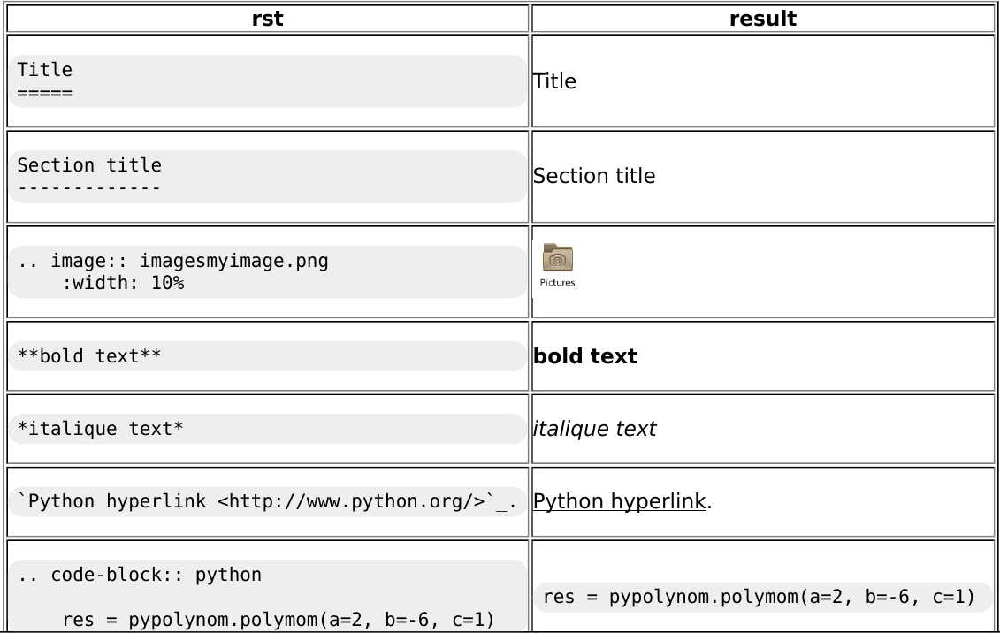
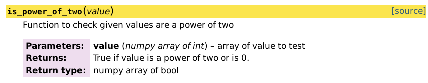

.. raw:: html

   <!-- Patch landslide slides background color --!>
   

.. include:: <isonum.txt>

=============
Documentation
=============

----

Documenting Python packages
---------------------------

Outline
.......

#. Introduction
#. reStructuredText
#. Readme file
#. Docstrings
#. Sphinx
#. Continuous Documentation

------

Introduction
------------

What is this function doing?

.. code-block:: python

   def p(x):
       return (x & (x - 1)) == 0

----

Introduction (2)
----------------

What is this function doing?

.. code-block:: python

   def is_power_of_two(value):
       return (value & (value - 1)) == 0

----

Introduction (3)
----------------

What is this function doing?

.. code-block:: python

   def is_power_of_two(value):
       """Returns True if value is a power of two.

       It supports numpy array of int of any dimensions and returns
       an array of bool of same dimensions.

       Limitation: Returns True for 0.
       """
       return (value & (value - 1)) == 0

------

Different types of documentations
---------------------------------

Credits:

Tarek Ziadé.
Expert Python Programming. Chapter 10: Documenting your project.
September 2008, PACKT Publishing.
https://tarekziade.files.wordpress.com/2008/09/chapter-10.pdf

See also `software documentation <https://en.wikipedia.org/wiki/Software_documentation>`_.

-----

Different types of documentation:

* **Operation**: Installation, FAQ

* **Usage**: How to use the software from API, command line or GUI:

  * *Cookbooks*: how to *do* something specific,
  * *Tutorials*: how to *use* a feature step-by-step,
  * *module API*.

* **Design**: How the software works, how code is organized.

  Intended audience: developers, advanced users looking for insights.

Structure all the documents: Index page, tree structure.

------

Main rules for technical writing:

* Write in two steps: Ideas first, then organisation and style.
* Target the readership.
* Use a simple style.
* Limit the scope of the information: One concept at a time.
* Use realistic code examples.
* Choose which documentation to write and avoid endless document.
* (Re)Use templates.

------

reStructuredText (rst)
----------------------

wikipedia definition:

`reStructuredText <http://docutils.sourceforge.net/rst.html>`_ is a file format for textual data used [...] for technical documentation.

* *Easy-to-read* text markup syntax.
* Conversion to different formats (e.g., html, pdf, latex).
* Version Control System friendly: Text files with one sentence per line.
* Primarily for Python documentation.

.. note:: All this presentation has been made using rst.

------

rst inline markup
-----------------

Allows character style and functionality:

+-----------------------------------------------------+-----------------------------------------------+
| rst                                                 | result                                        |
+=====================================================+===============================================+
| .. code-block:: text                                |                                               |
|                                                     |                                               |
|       *emphasis*                                    |     *emphasis*                                |
+-----------------------------------------------------+-----------------------------------------------+
| .. code-block:: text                                |                                               |
|                                                     |                                               |
|       **strong emphasis**                           |     **strong emphasis**                       |
+-----------------------------------------------------+-----------------------------------------------+
| .. code-block:: text                                |                                               |
|                                                     | `Python hyperlink <http://www.python.org/>`_. |
|    `Python hyperlink <http://www.python.org/>`_.    |                                               |
+-----------------------------------------------------+-----------------------------------------------+

for more inline markup: http://docutils.sourceforge.net/docs/user/rst/quickref.html#inline-markup

----

rst roles
---------

.. code-block:: rst

   :role_name:`content`

Examples:

- :literal:`:math:\`\\sqrt{\\frac{x^2}{3}}\`` |rarr| :math:`\sqrt{\frac{x^2}{3}}`
- `1\\ :superscript:`st`` |rarr| 1\ :superscript:`st`

`Documentation relative to roles <http://docutils.sourceforge.net/docs/ref/rst/roles.html>`_

----

roles are presented with colon, role name, colon, content

rst directive
-------------

.. code-block:: rst

  .. directive_type:: arguments
     :option: value

     Content: indented and separated by blank lines.

Example: **Code block** with syntax highlighting:

.. code-block:: rst

  .. code-block:: python

     def add(a, b):
         return a + b

|rarr| This directive will produce:

.. code-block:: python

   def add(a, b):
       return a + b

`Documentation relative to directives <http://docutils.sourceforge.net/docs/ref/rst/directives.html>`_.

Presenter Notes
...............

Now we will see in practice how we can use this rst format.

----

README
------

It will be the 'front door' of your project.

It should contains:

* Name of the project
* Brief description (i.e., abstract)
* Installation
* Documentation: Getting started and/or link to documentation.
* License
* Authors
* More if you think it is relevant

You can start from an existing template file:
    * https://github.com/konstantint/python-boilerplate-template/blob/master/README.rst
    * https://github.com/rtfd/template/blob/master/README.rst

Presenter Notes
...............

README is also commonly write in a .md file: markdown format.
Markdown is the format adopted by Doxygen. Both are very close.

------

Hands-on
--------

Write the README.rst of the project.

It should include the project name, description, installation, license and author.

You can use a `rst cheat sheet <https://github.com/ralsina/rst-cheatsheet/blob/master/rst-cheatsheet.rst>`_ and create/edit the README.rst file directly from github / gitlab (result preview can help you)

.. +-----------------------------------------------------+-----------------------------------------------+
.. | rst                                                 | result                                        |
.. +=====================================================+===============================================+
.. | .. code-block:: text                                |                                               |
.. |                                                     | Title                                         |
.. |    Title                                            |                                               |
.. |    =====                                            |                                               |
.. +-----------------------------------------------------+-----------------------------------------------+
.. | .. code-block:: text                                |                                               |
.. |                                                     |                                               |
.. |    Section title                                    |   Section title                               |
.. |    -------------                                    |                                               |
.. +-----------------------------------------------------+-----------------------------------------------+
.. | .. code-block:: text                                |                                               |
.. |                                                     |                                               |
.. |       .. image:: imagesmyimage.png                  | .. image:: images/myimage.png                 |
.. |           :width: 10%                               |     :width: 10%                               |
.. |                                                     |                                               |
.. +-----------------------------------------------------+-----------------------------------------------+
.. | .. code-block:: text                                |                                               |
.. |                                                     |                                               |
.. |       **bold text**                                 |     **bold text**                             |
.. +-----------------------------------------------------+-----------------------------------------------+
.. | .. code-block:: text                                |                                               |
.. |                                                     |                                               |
.. |       *italique text*                               |     *italique text*                           |
.. +-----------------------------------------------------+-----------------------------------------------+
.. | .. code-block:: text                                |                                               |
.. |                                                     | `Python hyperlink <http://www.python.org/>`_. |
.. |    `Python hyperlink <http://www.python.org/>`_.    |                                               |
.. +-----------------------------------------------------+-----------------------------------------------+
.. | .. code-block:: text                                |  .. code-block:: python                       |
.. |                                                     |                                               |
.. |       .. code-block:: python                        |     res = pypolynom.polymom(a=2, b=-6, c=1)   |
.. |                                                     |                                               |
.. |           res = pypolynom.polymom(a=2, b=-6, c=1)   |                                               |
.. +-----------------------------------------------------+-----------------------------------------------+

----

Docstrings
----------

.. code-block:: python

   """This module provides a random generator."""  # Module docstring

   RAND_SEED = 1
   """Seed used by rand."""  # Module attribute docstring

   def rand():
       """Returns a random floating point number."""  # Function docstring
       ...

   class RandomGenerator(object):
       """Pseudo random generator class.
       It is based on the XORShift algorithm.
       """  # Class docstring

       DEFAULT_SEED = 1
       """Default random generator seed."""  # Class attribute docstring

       def __init__(self, seed=None):
           self.seed = seed or self.DEFAULT_SEED
           """The generator's seed."""  # Instance attribute docstring

       def rand(self):
           """Returns a pseudo-random float."""  # Method docstring
           ...

Presenter Notes
...............

The docstring are accessible from python using help() or __doc__

------

Docstrings Content
..................

`PEP 257 <https://www.python.org/dev/peps/pep-0257/>`_ docstring content recommendation:

* For **script**: Module docstring should be its **usage message** from the command line.
* For **module**: List of the classes, exceptions and functions with a one-line summary of each.
* For **class**: **Behavior summary**, list of the public method and instance variables.
* For **function** and **method**: **Behavior summary**, documentation of **arguments**, **return value**, side effects, exceptions raised, restrictions.

-----

Sphinx
------

Wikipedia definition:

"Sphinx is a documentation generator written and used by the Python community. It is written in Python, and also used in other environments."

Sphinx is parsing docstrings to build html / pdf / latex documentation(s).
Sphinx is also sensible to rst format. So using the default rst syntax:

.. code-block:: python

   def is_power_of_two(value):
       """Function to check given values are a power of two

       :param value: array of value to test
       :type value: numpy array of int
       :return: True if value is a power of two or is 0.
       :rtype: numpy array of bool
       """
       return (value & (value - 1)) == 0

Presenter Notes
...............

sphinx is able to produce html / pdf documentation from docstring and a valid synthax based on rst.

This mean that you can add some rst information to be interpreted by sphinx.

----

Sphinx
------

install sphinx using:

.. code-block:: bash

    pip install sphinx

.. note:: `First steps with Sphinx <http://sphinx-doc.org/tutorial.html>`_.

----

Start up Sphinx
---------------

Sphinx documentation generation is based on a configuration file (conf.py)
Steps to create the sphinx configuration file

1. create a doc folder at the root level
2. execute

.. code-block:: bash

    sphinx-quickstart

this will create a source directory and a Makefile. To build the documentation just:

.. code-block:: bash

    make html

you can also call

.. code-block:: bash

    python setup.py build_sphinx -b html

or

.. code-block:: bash

    sphinx-build -b html sourcedir builddir

----

Start up Sphinx (2)
-------------------

|rarr| the doc/source directory contains the 'master document' file. By default the name is 'index.rst'.

|rarr| index.rst file is the entry point of the documentation.

|rarr| you can include other ``*.rst`` files to write the documentation.

index.rst file contains:

Table of content
................

.. code-block:: rst

  Contents:

  .. toctree::
     :maxdepth: 2

     polynom.rst
     mathutils.rst

----

Start up Sphinx (3)
-------------------

The different *.rst files are used to

* To structure the documentation.
* To select what is documented.
* To avoid pollution of the source code with too much documentation.

----

Start up Sphinx (4)
-------------------

autodoc
.......

The sphinx extension ``sphinx.ext.autodoc`` includes docstrings from source code in the generated documentation.

This will allow you to define what should be included in the documentation and what shouldn't

.. code-block:: rst

  .. autofunction:: <function_name>

  .. automodule:: <module_name>
     :members: <optional: list of members>
     :undoc-members:

  .. autoclass:: <class_name>
     :members: <optional: list of members>
     :undoc-members:
     :inherited-members:

And more: ``autoexception, autodata, automethod, autoattribute``

Warning: autodoc **imports** the modules to be documented.
The modules must be installed or added to ``sys.path`` in ``conf.py``.
Take care which version gets documented.

See `sphinx.ext.autodoc documentation <http://sphinx-doc.org/ext/autodoc.html#module-sphinx.ext.autodoc>`_.

----

autodoc (2)
...........

For example a simple polynom.rst can look like:

.. code-block:: rst

  .. currentmodule:: pypolynom.polynom

  :mod:`polynom`: Polynom
  -----------------------

  .. automodule:: pypolynom.polynom
      :members: polynom

----

Info field lists
................

Info field list are sequences of fields marked up.
They are usefull in order to document functions for example:

.. code-block:: python

   def random_xorshift32(last_value, shift_triple=(13, 17, 5)):
       """32 bits pseudo-random generator.

       :param numpy.uint32 last_value: Previously returned number or the seed.
       :param shift_triple: Bit shifts to use.
       :type shift_triple: 3-tuple of int
       :return: The generated random number.
       :rtype: numpy.uint32
       :raises ValueError: if x is not a numpy.uint32
       """
       x = numpy.uint32(last_value)  # Work with 32bits unsigned integer
       x ^= numpy.uint32(last_value) << shift_triple[0]
       x ^= x >> shift_triple[1]
       x ^= x << shift_triple[2]
       return x

Alternative syntax from `Napoleon extension <http://sphinxcontrib-napoleon.readthedocs.org>`_

- `Google style <http://sphinxcontrib-napoleon.readthedocs.org/en/latest/example_google.html>`_
- `Numpy style <http://sphinxcontrib-napoleon.readthedocs.org/en/latest/example_numpy.html#example-numpy>`_

----

Hands on
--------

1. Generate the html documentation of your master branch. Open it using a web browser.

2. Embed documentation of the polynom module. Make sure it contains the documentation of the polynom function.

3. Document the mathutil module with (rst) docstring and regenerate documentation

    |rarr| add docstrings (rst format) to the mathutil.py file

    |rarr| add a mathutil.rst file to embed documentation about the mathutil module

    |rarr| specify the class, function... to include in the documentation

    |rarr| include the mathutil.rst file into the index.rst file

    |rarr| regenerate the documentation

----

Sphinx
------

.. note:: *.rst files can be generated automatically using **sphinx-apidoc**. See https://www.sphinx-doc.org/en/master/man/sphinx-autogen.html

.. code-block:: bash

   sphinx-apidoc -o doc/ ./

----

sphinx extensions
-----------------

Sphinx is including several extensions like:

* mathjax: for math formula, rendered in the browser by MathJax
* autodoc: automatically insert docstrings from modules
* viewcode: include links to source

.. note:: the extensions to use has to be registred on your sphinx conf.py file

.. code-block:: python

    extensions = [
        # automatically insert docstrings from modules
        'sphinx.ext.autodoc',

        # include math, rendered in the browser by MathJax
        'sphinx.ext.mathjax',

        # include links to source
        'sphinx.ext.viewcode'
    ]

`see more sphinx extensions <http://www.sphinx-doc.org/en/stable/extensions.html>`_

----

sphinx extensions (2)
---------------------

several third party libraries are also defining there own directives and/or roles.
rst format is fairly easy to extend.

* `matplotlib plot <https://matplotlib.org/devel/plot_directive.html>`_
* `embed video <https://github.com/sphinx-contrib/video>`_
* `list of reference contribution <https://www.sphinx-doc.org/en/master/develop.html>`_
* `github sphinx contrib <https://github.com/sphinx-contrib>`_

----

Embed a jupyter notebook into doc
---------------------------------

You can also embed jupyter notebooks into documentation using `'nbsphinx' extension <https://nbsphinx.readthedocs.io/en/0.4.2/>`_.

Especially if tutorials are already existing, no need for duplicate code.

see: https://gitlab.esrf.fr/silx/pypolynom_completed/blob/master/doc/source/index.rst which embed the tutorial.ipynb notebook.

----

Continuous documentation
------------------------

Building documentation automatically from `Read the Docs <https://readthedocs.org/>`_.

It builds the documentation with Sphinx:

* Install dependencies defined in a *requirements file*.
* Install the package with ``setup.py install``.
* Look for a ``conf.py`` file and use it to build the documentation.
* Make documentation available: ``http://<project_name>.readthedocs.org/``.

`Documentation of Read the Docs <http://read-the-docs.readthedocs.org/>`_

gitlab also offer the feature `'pages' <https://docs.gitlab.com/ee/user/project/pages/>`_. which allows you to publish static websites that can be generated from CI.
see the `gitlab-ci.yml file <https://gitlab.esrf.fr/silx/pypolynom_completed/blob/master/.gitlab-ci.yml>`_ and the `gitlab project pages <https://gitlab.esrf.fr/silx/pypolynom_completed/pages>`_

------

Conclusion
----------

* README file matter
* Different documentation for different purposes.
* Use tools to ease the process.
* Having a build system that generates the documentation encourages writing it.
* Documentation becomes out-dated, keeping it with the source code helps maintaining it: update the code and the documentation at the same time.

This presentation is written in reStructuredText_.

.. _reStructuredText: http://docutils.sourceforge.net/rst.html
